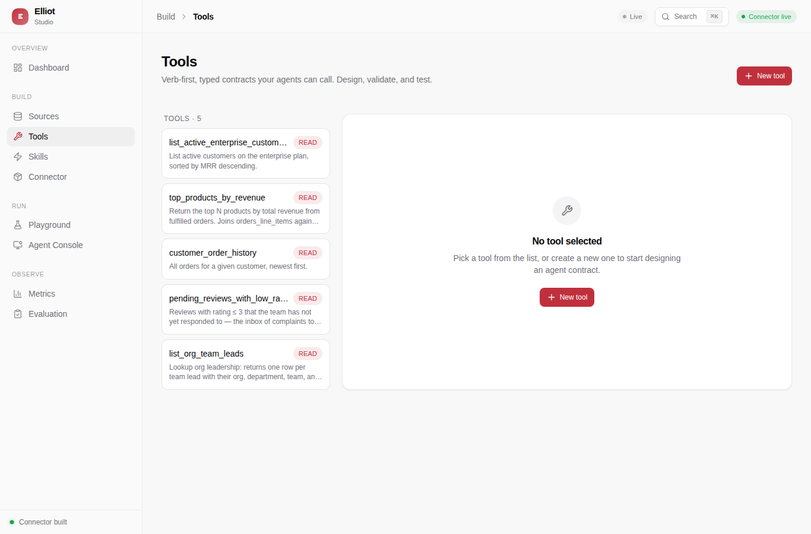
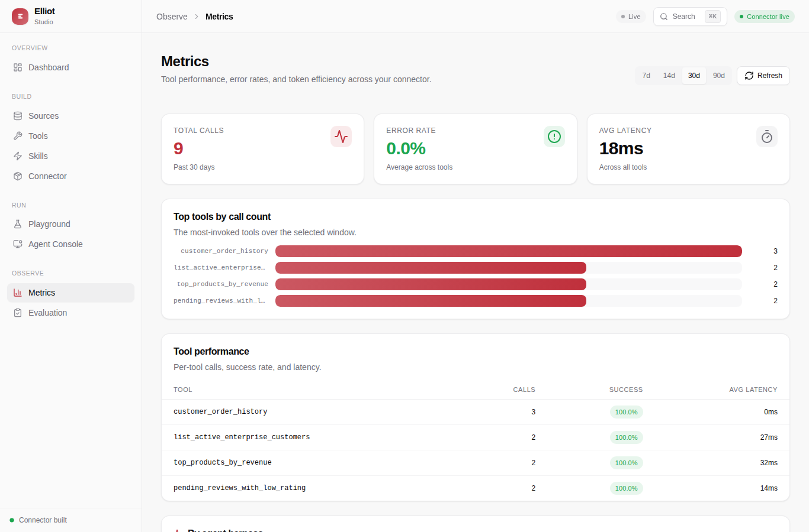
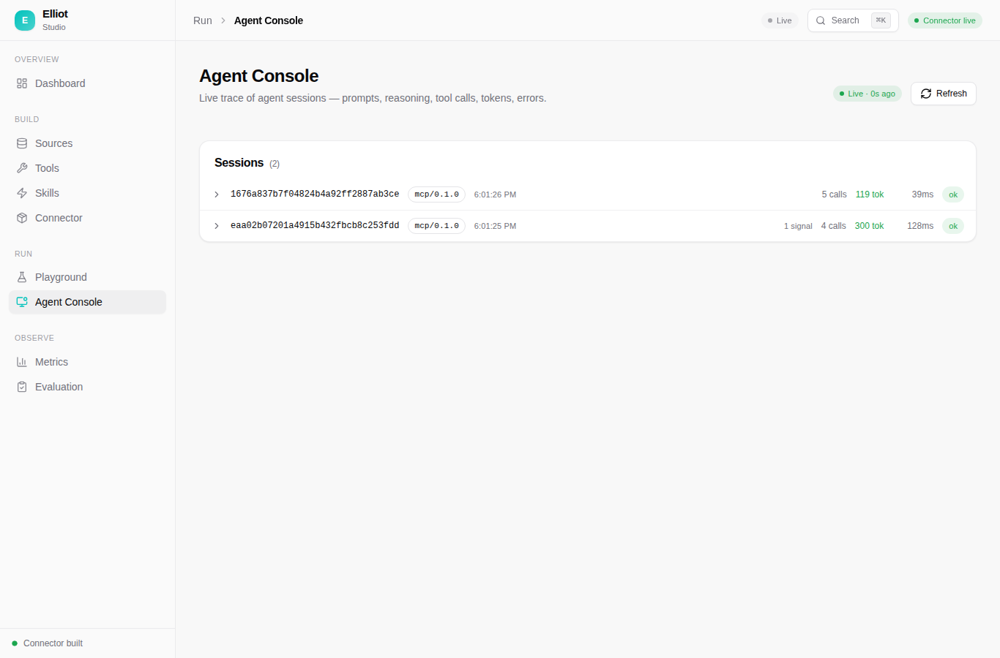
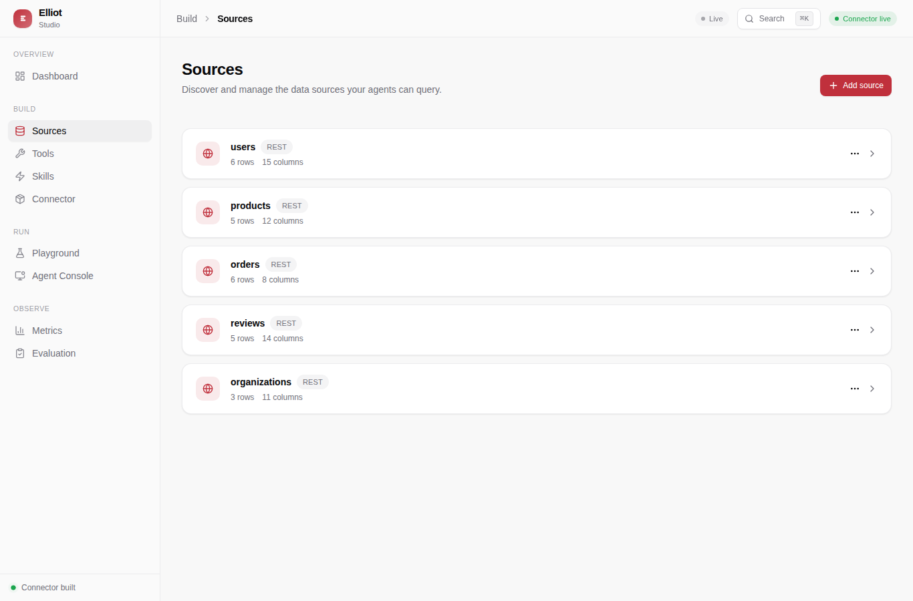

<div align="center">


# Elliot

**Turn any API or database into MCP tools for Claude Code, Cursor, OpenClaw, and Codex — with built-in observability.**

[](https://github.com/EliBarak12/Elliot/actions/workflows/ci.yml)
[](https://github.com/EliBarak12/Elliot/actions/workflows/docs.yml)
[](LICENSE)
[](https://modelcontextprotocol.io)
[](pyproject.toml)

[Documentation](https://elibarak12.github.io/Elliot/) · [Quickstart](https://elibarak12.github.io/Elliot/docs/quickstart) · [Concepts](https://elibarak12.github.io/Elliot/docs/concepts) · [The five principles](https://elibarak12.github.io/Elliot/docs/five-principles)

</div>

---

Elliot is an open-source platform for turning the products you already have — REST APIs, SQL databases, files — into tools that AI agents can use *well*. Not just connected, but fast, safe, and observable: minimal token usage, structured errors the agent can recover from, and a full trace of every agent session.

The target user is a product engineer who has a working API or database today and wants AI agents to interact with it natively — with minimum tokens, clean error recovery, and full observability.

> AX is to agents what UX is to users and DX is to developers. Elliot's job is to make AX measurable.

## Table of contents

- [Why Elliot](#why-elliot)
- [Features](#features)
- [Quickstart](#quickstart)
- [See it in action](#see-it-in-action)
- [How it works](#how-it-works)
- [Connect your coding agent](#connect-your-coding-agent)
- [Project layout](#project-layout)
- [Documentation](#documentation)
- [Roadmap](#roadmap)
- [Contributing](#contributing)
- [Community and support](#community-and-support)
- [License](#license)

## Why Elliot

Connecting an API to an agent is easy. Making it work *well* is not. Agents fail when:

- **Tool descriptions are vague** — the agent picks the wrong tool.
- **Results are too large** — the context window fills up before the answer does.
- **Errors are unstructured** — the agent cannot recover or escalate.
- **Nothing is observable** — you do not find out it is broken until a user complains.

Elliot makes each of these visible and fixable. Every tool ships with a structured schema, a token estimate, an actionable error shape, and a session trace — every call, every agent, attributed to a client and model.

## Features

- **Agent-ready by design** — every tool is linted against five concrete principles before it ships: verb-first descriptions, typed parameters, context-sized results.
- **Safe by default** — parameterised SQL, read-only database transactions, env-var secrets, no keys in connector files. Connector files are safe to commit.
- **Every call observable** — tokens, latency, arguments, and errors for every agent call, streamed to an audit log and visible in Studio.
- **One command to run** — start the whole stack with Docker. No Python, Node, or toolchain to install.
- **Works with every agent** — Claude Code, Cursor, OpenClaw, and Codex. Elliot auto-registers with each.
- **Agents build connectors** — discover, build, lint, eval, deploy. The platform itself is agentic: agents can build connectors through Elliot.

## Quickstart

**Just want to run Elliot?** The only prerequisite is [Docker](https://docs.docker.com/get-docker/) — no Python, Node, `uv`, or `pnpm`:

```bash
curl -LsSf https://raw.githubusercontent.com/EliBarak12/Elliot/main/scripts/install.sh | sh
```

This pulls the pre-built images, generates a local `.env`, starts all three services, and opens Studio at <http://localhost:8080>. Stop it any time with `docker compose -f docker-compose.run.yml down`.

**Want to develop Elliot?** Build from source instead:

```bash
# Prerequisites: uv (Python 3.13) and pnpm (Node 22)
git clone https://github.com/EliBarak12/Elliot.git && cd Elliot
make setup
make dev          # boots plugin (:3000) + runtime (:3001) + studio (:5173)
                  # and writes the MCP config for every detected coding agent
```

Then open Studio at <http://localhost:5173>, scaffold a connector, lint it, and your agent can use it in the same session.

## See it in action

A walkthrough of Elliot Studio — the visual dashboard that observes, runs, and edits everything an agent builds.

<div align="center">
  
</div>

> The loop above cycles through every Studio page. For the full-quality screencast, [watch the video walkthrough](docs/screenshots/elliot-demo.webm).

Studio in detail:

<table>
<tr>
<td width="50%"></td>
<td width="50%"></td>
</tr>
<tr>
<td><b>Tools</b> — verb-first, typed contracts your agents call. Design, validate, and test each one.</td>
<td><b>Metrics</b> — calls, error rate, latency, and token efficiency across every tool.</td>
</tr>
<tr>
<td width="50%"></td>
<td width="50%"></td>
</tr>
<tr>
<td><b>Agent Console</b> — a live trace of every agent session: prompts, tool calls, tokens, errors.</td>
<td><b>Sources</b> — REST APIs, PostgreSQL, MySQL, and files, discovered and managed in one place.</td>
</tr>
</table>

## How it works

```
1. Connect your data sources
   REST APIs, PostgreSQL, MySQL, CSV / JSON files — all in one connector

2. Build tools (no SQL required)
   Define name, description, parameters, filters, and return fields
   Elliot generates safe, parameterised queries
   Or let an agent build the connector for you with the agentic builder

3. Lint for agent-readiness
   elliot lint my-domain.connector.json

4. Write and run eval cases
   elliot eval my-domain.eval.yaml — pass/fail plus a token estimate

5. Deploy and connect agents
   plugin (:3000) serves tools to any MCP client
   runtime (:3001) executes them against live data
   studio observes, runs, and edits everything

6. (Optional) Ship the connector as a plugin
   elliot export-plugin my-domain.connector.json
   produces an installable Codex + Claude Code plugin folder
```

On first connect, an agent automatically calls `prompts/get name=getting_started` — a single prompt that teaches it the five principles, the canonical workflow, and the reference resources available.

## Connect your coding agent

`make dev` runs `elliot connect`, which detects every coding agent on your machine and writes its MCP config automatically. To wire a client by hand:

<table>
<tr><th>Claude Code</th><th>Cursor</th></tr>
<tr><td>

```
/plugin marketplace add EliBarak12/Elliot
/plugin install elliot@elliot
```

</td><td>

Install the bundled plugin (`.cursor-plugin/`) from the Cursor marketplace, or add the MCP server by hand:
```json
{ "mcpServers": { "elliot": {
  "url": "http://localhost:3000/mcp/"
}}}
```

</td></tr>
<tr><th>Codex</th><th>OpenClaw</th></tr>
<tr><td>

```
codex plugin marketplace add EliBarak12/Elliot
```

Then open the plugin directory in Codex and install `elliot`. Codex reads `.agents/plugins/marketplace.json` and the manifest at `.codex-plugin/plugin.json`.

</td><td>

```
openclaw plugins install elliot@elliot
```

OpenClaw also reads the `.claude-plugin/`, `.codex-plugin/`, and `.cursor-plugin/` bundles directly. `elliot connect` writes `~/.openclaw/openclaw.json` with the `streamable-http` transport.

</td></tr>
</table>

Every install path wires the MCP URL only — Elliot's server still needs to be running, locally or at a hosted endpoint. Skills ship in the repo-root `skills/` directory; Claude Code and Codex auto-discover them, and every other MCP client receives the same guidance as MCP prompts.

### Ship a connector as its own plugin

Once you've built a connector, package it as a standalone plugin that installs in Codex *and* Claude Code:

```
elliot export-plugin my-domain.connector.json
```

This scaffolds a `my-domain-plugin/` folder with the Codex and Claude Code manifests, marketplaces, an `.mcp.json` that serves the connector over stdio (`elliot-mcp --connector`), and a `skills/` directory. The MCP server is named after the connector slug, so its tools are `mcp__<slug>__<tool-id>`; the generated skills — a usage guide plus one per connector workflow — already reference that prefix. Install it with `/plugin marketplace add <folder>` (Claude Code) or `codex plugin marketplace add <folder>` (Codex).

## Project layout

Elliot is a monorepo of four packages:

| Package | Name | Stack | Role |
|---|---|---|---|
| `packages/core` | `elliot-core` | Python 3.13 | Types, query builder, linter, eval harness, CLI |
| `packages/mcp-plugin` | `elliot-mcp-plugin` | Python 3.13 · FastMCP | MCP endpoint and agentic builder — port `3000` |
| `packages/connector-runtime` | `elliot-connector-runtime` | Python 3.13 · FastAPI | Tool execution and session/observation store — port `3001` |
| `packages/studio` | `elliot-studio` | React 19 · Vite | Visual dashboard — port `5173` (dev) / `8080` (Docker) |

Connector files live in `connectors/`, starter templates in `templates/`, and every environment variable is documented in [`.env.example`](.env.example).

## Documentation

Full documentation lives at **[elibarak12.github.io/Elliot](https://elibarak12.github.io/Elliot/)**.

- [Quickstart](https://elibarak12.github.io/Elliot/docs/quickstart) — get a connector running in minutes
- [Concepts](https://elibarak12.github.io/Elliot/docs/concepts) — sources, tools, skills, connectors
- [The five principles](https://elibarak12.github.io/Elliot/docs/five-principles) — the design rules every connector follows
- [Connector spec](https://elibarak12.github.io/Elliot/docs/connectors) — the full `.connector.json` schema
- [Architecture](https://elibarak12.github.io/Elliot/docs/architecture) — how the three services fit together
- [Deployment](https://elibarak12.github.io/Elliot/docs/deployment) — Docker images, env vars, hosting

## Roadmap

Elliot's goal is to be usable by everyone, not just developers. Progress is tracked in [`docs/USER_ONBOARDING.md`](docs/USER_ONBOARDING.md).

| Status | Milestone |
|---|---|
| Shipped | Run from source — `make dev` for contributors |
| Shipped | One-command Docker — run with only Docker, no toolchain |
| Planned | Guided first-run — an onboarding wizard inside Studio |
| Planned | Desktop app — a double-click app, no Docker, no terminal |
| Planned | Hosted cloud — a connector registry and a managed runtime, no install at all |

## Contributing

Contributions are welcome — code, connectors, docs, and bug reports alike.

- Browse [good first issues](https://github.com/EliBarak12/Elliot/issues?q=is%3Aopen+label%3A%22good+first+issue%22) to get started.
- New connectors are especially valuable — see the [connector request template](.github/ISSUE_TEMPLATE/connector_request.yml).
- Before opening a PR, run the mandatory checks below. All six must pass.

```bash
uv run ruff check .
uv run ruff format --check .
uv run mypy packages/core/src packages/mcp-plugin/src packages/connector-runtime/src
uv run pytest --tb=short
pnpm --filter @elliot/studio run typecheck
pnpm --filter @elliot/studio test --run
```

## Community and support

Found a bug, have a feature request, or want to propose a connector? Open an issue on the [issue tracker](https://github.com/EliBarak12/Elliot/issues) — we read every one.

## License

Elliot is released under the [MIT License](LICENSE).
