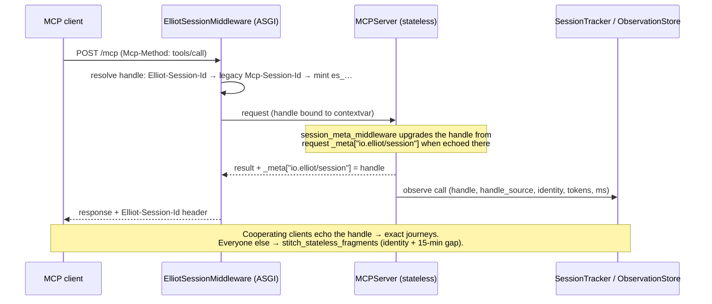

# MCP 2026-07-28: Stateless Core, Elliot Sessions, MCP Apps

Elliot speaks the MCP **2026-07-28** revision (SDK `mcp==2.0.0`) while still
serving every 2025-era handshake client from the same endpoints. Three things
changed architecturally; everything else is compatibility plumbing inside
`elliot_core.mcp_compat` (the single SDK touchpoint — start there for any
future SDK bump).

## 1. Stateless transport, Elliot-tracked sessions

The 2026 revision removed protocol sessions: no `initialize` handshake, no
`Mcp-Session-Id`, every request self-describing via `_meta`
(`io.modelcontextprotocol/protocolVersion` / `clientInfo` /
`clientCapabilities`). Both servers now run the streamable-HTTP transport
with `stateless_http=True` — any replica can serve any request, and a
republish never strands a client on a dead in-memory session.

Session continuity is Elliot's own, per the spec's server-minted-handle
guidance:



Key pieces:

- `elliot_core/session_handle.py` — handle minting/resolution/contextvar
  (mutable box, so a mid-request `_meta` upgrade reaches the response header).
- `elliot_core/http_middleware.py::ElliotSessionMiddleware` — ASGI tier.
- `elliot_core/mcp_compat.py::session_meta_middleware` — MCP tier (result
  `_meta` echo).
- `elliot_connector_runtime/session_tracker.py::stitch_stateless_fragments`
  — logical-journey reassembly, shared with Elliot Cloud;
  `/v1/sessions?stitched=1` (default) serves it, `stitched=0` shows raw
  fragments.
- `client_handshakes` telemetry records per call now — 2026 clients never
  send `initialize`.

## 2. MCP Apps: interactive views for tools

Tools with a `ui` block (see `ToolUIConfig` in `elliot_core/types/tool.py`)
are served with an interactive view per the ext-apps spec (2026-01-26):

```mermaid
sequenceDiagram
    participant Host as Host (Claude / Studio preview)
    participant Srv as connector-runtime
    participant View as ui:// view (sandboxed iframe)

    Host->>Srv: tools/list
    Srv-->>Host: tool + _meta.ui.resourceUri = ui://slug/tool_id
    Host->>Srv: tools/call list_orders
    Host->>Srv: resources/read ui://slug/tool_id
    Srv-->>Host: single-file HTML (text/html;profile=mcp-app)
    Host->>View: render in sandboxed iframe (CSP from resource _meta.ui)
    View->>Host: ui/initialize → theme, CSS variables, dimensions
    Host->>View: ui/notifications/tool-input + tool-result
    View->>Host: ui/update-model-context ("user selected row …")
```

- `packages/ui-kit` — React + `@modelcontextprotocol/ext-apps` presets
  (table/detail/metric/markdown; `auto` resolves by result shape at render
  time), built by `pnpm --filter @elliot/ui-kit run build` into ONE
  self-contained HTML committed at
  `packages/core/src/elliot_core/apps/assets/elliot-app.html` (wheel package
  data — installing core needs no Node). CI runs `… run check` to
  byte-verify the committed asset against the source.
- `elliot_core/apps/` — per-tool config injection, custom-template
  resolution (path-contained, ≤256 KiB), `build_apps_extension` feeding the
  SDK's `mcp.server.apps.Apps` extension (constructed BEFORE the server —
  the SDK consumes extensions in `__init__`).
- Lint: `UI_MAPPING_UNKNOWN_FIELD`, `UI_CUSTOM_HTML_MISSING`,
  `UI_CUSTOM_HTML_TOO_LARGE`, `UI_CSP_UNDECLARED_DOMAIN`,
  `UI_FORM_PRESET_MISUSE`, `UI_PRESET_UNAVAILABLE`.
- Studio: tool editor "Interactive view" section + `AppPreviewHost` (a real
  ext-apps host: AppBridge over postMessage, nested `tools/call` proxied
  through `elliot_preview_tool`); Playground App|JSON toggle.

## 3. What deliberately did NOT change

- 2025-era clients (Claude Desktop today, Studio's TS SDK 1.29 client, the
  raw-JSON-RPC regression tests) still connect via `initialize` — the SDK
  serves both eras from one app with no flags.
- The deprecated `logging` capability is still answered
  (`register_legacy_set_level`) and `notifications/message` still streams
  per-call telemetry to 2025 clients; on the 2026 path the SDK gates
  delivery on the per-request `_meta` log-level opt-in.
- `{slug}_get_task` remains the async-tool polling surface. The formal Tasks
  extension ships types-only in SDK 2.0.0 (no server-side helper) — adopt it
  when the SDK does.
- Destructive confirmation keeps the `confirm=true` + `CONFIRMATION_REQUIRED`
  contract. An MRTR/elicitation-based flow (the SDK's `Resolve`/`Elicit`
  pattern) is a candidate follow-up, behind a flag, once host support is
  observable.

## Gotchas worth remembering

- The v2 SDK enforces DNS-rebinding Host checks by default → 421 for Docker
  service names / proxies. `mcp_compat.build_http_app` disables it (Elliot
  has its own auth); pass explicit `TransportSecuritySettings` to re-enable.
- 2026 header routing REQUIRES `Mcp-Name` to match `params.name` on
  `tools/call` (else `-32020 HeaderMismatch`) and `MCP-Protocol-Version:
  2026-07-28` to select the modern path.
- Lists are cacheable in 2026 — keep them client-invariant. Tool `_meta.ui`
  is always attached; hosts without Apps support ignore it.
