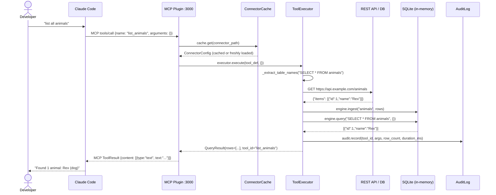
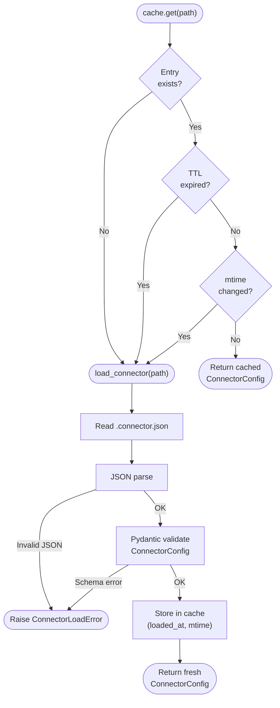
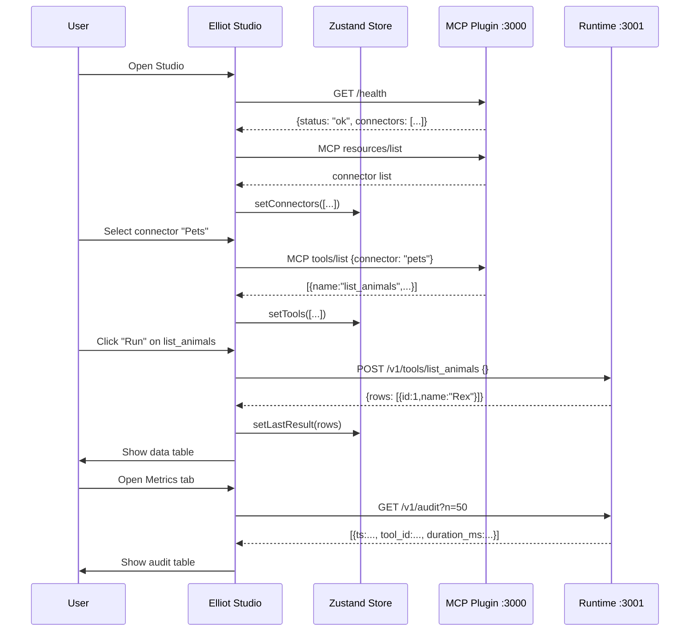
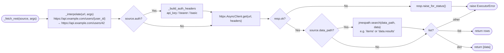
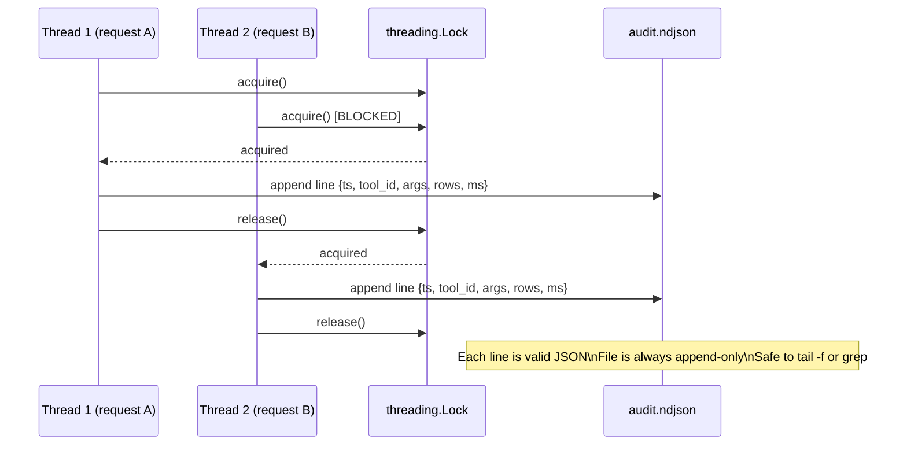
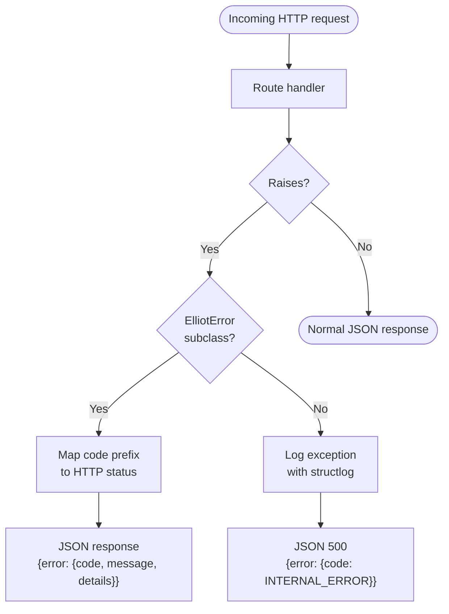

# Elliot — Data Flow Diagrams

## 1. Tool Call: End-to-End (Claude Code → Result)

---

## 2. Connector Load & Cache

---

## 3. Studio UI — Data Flow

---

## 4. Executor: REST Source with Auth

---

## 5. Audit Log Write Path

---

## 6. Error Handling Flow

