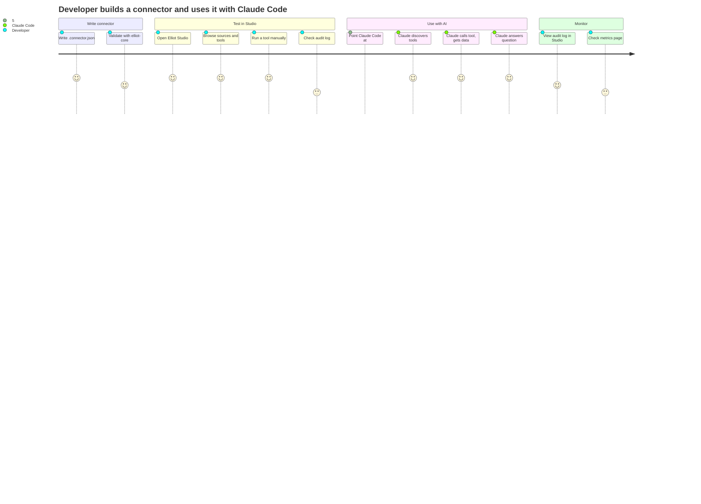
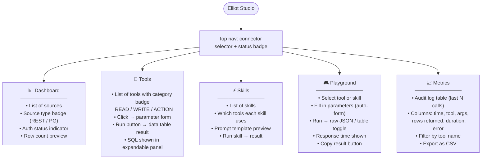
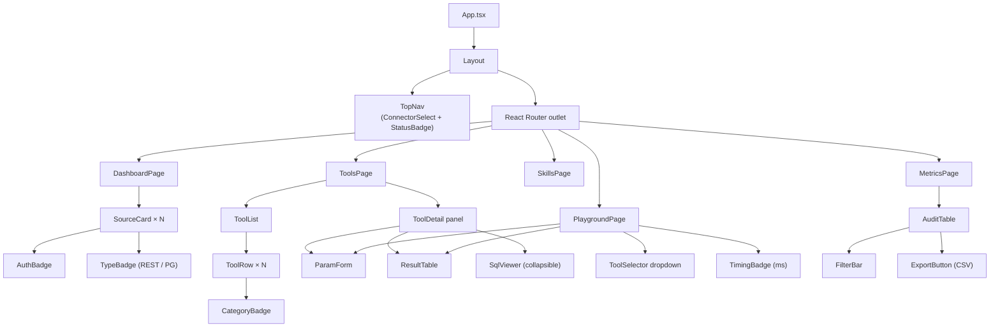
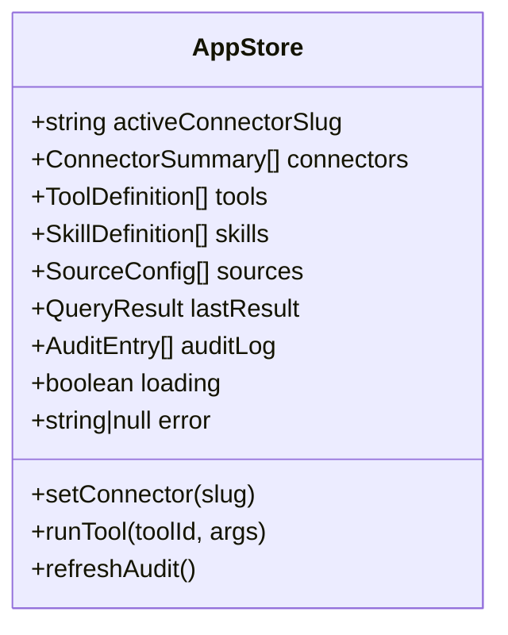

# Elliot — Product Overview

## What is Elliot?

Elliot is a **connector platform** that turns any REST API or database into a set of MCP (Model Context Protocol) tools that AI coding agents (Claude Code, Codex, etc.) can call directly.

A developer writes a single `.connector.json` file describing their data sources and the SQL queries they want to expose as tools. Elliot does the rest: schema generation, HTTP fetching, SQL execution, auth, and audit logging.

---

## User Journey



---

## Studio Pages & Navigation



---

## Studio UI Component Tree



---

## State Shape (Zustand)



---

## What a `.connector.json` looks like

```json
{
  "name": "Pet Store API",
  "slug": "petstore",
  "version": "1.0.0",
  "sources": [
    {
      "id": "animals",
      "name": "Animals endpoint",
      "type": "rest",
      "url": "https://api.example.com/animals",
      "data_path": "items",
      "auth": {
        "type": "api_key",
        "secret_key": "PETSTORE_API_KEY",
        "header_name": "X-Api-Key"
      }
    }
  ],
  "tools": [
    {
      "id": "list_animals",
      "name": "List animals",
      "description": "Return all animals, optionally filtered by species",
      "category": "READ",
      "sql": "SELECT * FROM animals WHERE (:species IS NULL OR species = :species)",
      "parameters": [
        {
          "name": "species",
          "type": "string",
          "description": "Filter by species (optional)",
          "required": false
        }
      ]
    }
  ],
  "skills": [
    {
      "id": "animal_report",
      "name": "Animal population report",
      "description": "Summarise all animals grouped by species",
      "tool_ids": ["list_animals"],
      "prompt_template": "Using the results of list_animals, group by species and return counts."
    }
  ]
}
```

---

## Key Design Decisions

| Decision | Choice | Why |
|---|---|---|
| MCP transport | StreamableHTTP | Works with Claude Code out of the box; no stdio process needed |
| Query engine | Ephemeral in-memory SQLite | No persistent state; each call is fresh; jmespath handles nested API responses |
| Cache strategy | TTL + mtime | Hot-reload without restart; 30 s TTL catches most changes |
| Audit format | NDJSON | Greppable, streamable, importable into any log tool |
| Auth secrets | Env vars / secrets file | Never stored in connector.json; safe to commit connector definitions |
| Studio stack | React + Vite + Zustand | Fast dev, minimal boilerplate, easy MCP client integration |
