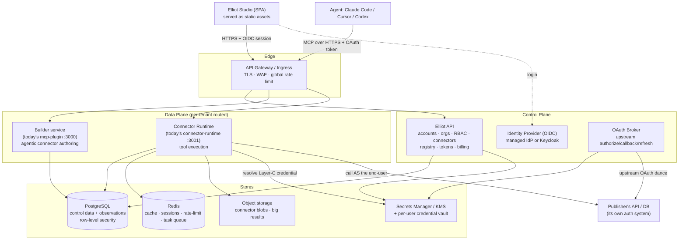
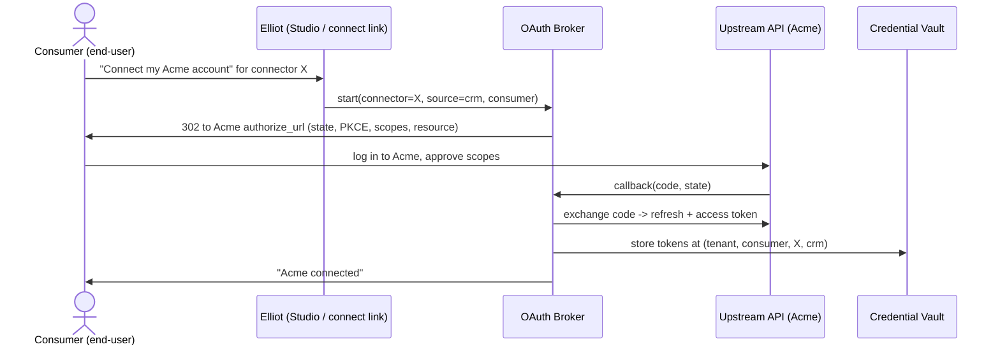

# Elliot — Cloud Deployment, Authentication & Authorization Plan

> Status: design proposal. This document is the architecture plan for taking
> Elliot from a single-deployment local tool to a multi-tenant cloud platform
> where independent users publish, distribute, and consume connectors — and
> where each connector can serve **per-end-user data** from an upstream API
> that has its own auth system.
>
> It corresponds to the `epic/10-cloud-platform` work and supersedes the
> "Phase 3 — Cloud Runtime" stub in `docs/PRODUCT_SPECIFICATION.md`.

---

## 1. Executive Summary

Today Elliot is **single-tenant**. One deployment serves one team. Auth is one
shared key (`ELLIOT_API_KEY`), connectors are JSON files on a disk the operator
controls, and every upstream API is called with **one credential** baked into
the deployment's environment (`{{ env:VAR }}`). There is no concept of a user,
an organization, or an end-user whose data must stay private.

The goal of this plan is a hosted Elliot where:

1. A **publisher** (the product engineer — Alex/Maria from the user stories)
   signs up, builds a connector against *their* API/DB, and publishes it.
2. A **consumer** installs that connector into their agent (Claude Code,
   Cursor, Codex) by pointing at a hosted, per-tenant MCP URL — no local
   `make dev` required.
3. When the publisher's API is itself **auth-protected and per-user**, each
   consumer's agent calls reach the upstream API **as that specific
   end-user**, so the upstream's own authorization returns only that user's
   data. No connector author has to hand-write tenant filters, and no
   credential is ever shared across users.

The three hard problems, and how this plan solves them:

| Problem | Solution |
|---|---|
| Who is calling Elliot? | A real **control plane**: orgs, users, RBAC, an OIDC identity provider, and Elliot-issued scoped tokens. The MCP endpoints become OAuth 2.1 protected resources. |
| How do consumers reach a published connector? | A **connector registry** + per-tenant **data-plane routing**: each connector install gets its own authenticated MCP URL; connectors move from disk files to a database. |
| How does a connector return *the calling user's* upstream data? | A **per-end-user credential model**: three `auth.binding` modes — `static`, `per_user`, `oauth2_delegated` — backed by an **OAuth broker** and an encrypted **credential vault** keyed by `(tenant, end-user, connector, source)`. The upstream API's own auth does the row-level scoping. |

A critical correctness rule falls out of problem 3: **data fetched with a
per-end-user credential must never be cached or materialized into shared
state.** Today's executor caches upstream rows in a process-wide in-memory
SQLite engine for 300s (`executor.py:_ensure_materialized`). In a multi-tenant
world that is a cross-user data leak. Section 7 specifies the fix.

---

## 2. Current State — Honest Gap Analysis

Grounded in the actual code. Each row is something the cloud plan must change.

| Area | Today | Gap for cloud |
|---|---|---|
| **Identity** | None. `ApiKeyMiddleware` checks one `ELLIOT_API_KEY` for all callers. | No users, orgs, roles, or per-caller identity. |
| **Authorization** | Binary: have the key or not. | No RBAC, no connector ownership, no scoped access. |
| **Studio auth** | `VITE_API_KEY` baked into the browser bundle — explicitly "not a per-user secret" (`studio/src/lib/http.ts:5-8`). | Anyone loading Studio reads the deployment key. Unusable for multi-user. |
| **MCP auth** | Two MCP surfaces — the **builder** (`mcp-plugin`, agentic connector authoring) and the **runtime** (`connector-runtime`, published tools) — both accept a bare URL with no token from the MCP client. | **Both** MCP endpoints must authenticate the connecting agent; a URL alone cannot identify a tenant, user, or workspace. The builder MCP especially: an agent connected there can create/edit/delete connectors. |
| **Trace ingest** | `/v1/trace/ingest` (added on `main`) accepts harness traces — agent **reasoning**, **user prompts**, **final output** — with no auth. `/v1/sessions/stream` (SSE) is also open. | These carry sensitive run data; they must be authenticated and tenant-scoped, and the local trace hook adapter must ship a per-user token. |
| **Connector storage** | `*.connector.json` files in `ELLIOT_CONNECTORS_DIR`, loaded from disk (`loader.py`), 30s path-keyed cache. Builder drafts live in local `.elliot/session.json`. | No DB, no ownership, no versioning, no visibility rules. The agentic builder's mutations must persist to a per-user **cloud workspace**, not local disk. |
| **Upstream credentials** | One value per source, resolved from process env at *connector load time* (`secrets.py`, `executor._build_auth_headers`). | One credential for everyone. Cannot serve per-end-user data. `AuthConfig.type` lists `oauth2` but there is **no OAuth implementation**. |
| **Runtime model** | One process loads one connector (or one dir) into one `ToolExecutor` with one `secrets` dict (`server.py:create_app`). | Process-wide singletons. No tenant routing. |
| **Materialization cache** | Upstream rows flattened into a **process-wide in-memory SQLite** engine, cached 300s, shared by all callers (`executor.py:38-220`). | **Cross-user data leak** the moment two users share a runtime. |
| **Observability** | `agent_sessions` / `tool_calls` tables keyed only by `connector_slug` (`observation_store.py`). NDJSON logs on local disk. | No `tenant_id` / `user_id`; no isolation; local files don't survive a container. |
| **Async tasks** | `task_store` is **in-memory** (`get_task_store()`). | Lost on restart; not shared across runtime replicas. |
| **Secrets at rest** | `.elliot/secrets.enc`, AES-GCM, one passphrase `ELLIOT_SECRET_KEY` per deployment. | One key for the whole deployment; no per-tenant isolation; not a managed KMS. |
| **Distribution** | `.claude-plugin` / `.codex-plugin` marketplaces ship the *platform builder* plugin; every install path wires `http://localhost:3000/mcp/`. | No way to install a *published connector*; everything points at localhost. |
| **Network** | Compose binds all services to `127.0.0.1`; CORS locked to one Studio origin; SSRF guard (`elliot_core/http.py`) and body-size cap exist. | Good hygiene to keep — but built for a single trusted host. |

**What is already good and should be kept:** structured errors (`ElliotError`),
SSRF-hardened outbound HTTP (`safe_client` / `validate_url`), rate limiting
(`slowapi`), body-size cap, constant-time key comparison, agent-identity
parsing for observability, redaction in audit logs, non-root Docker images.
The plan builds on these, it does not replace them.

---

## 3. Identity — The Three Layers

Every design decision below depends on separating three distinct identities.
Conflating them is the root cause of most multi-tenant security bugs.

```
 Layer A — Platform identity
   WHO is the publisher / operator account inside Elliot.
   e.g. "maria@acme.com", member of org "Acme", role "Connector Author".
   Used for: building connectors, billing, managing the org.

 Layer B — Consumer identity
   WHO is operating the agent that calls a published connector.
   May be the publisher themselves, a teammate, or an external customer
   of the publisher. Authenticated to Elliot; this is the identity Elliot
   trusts and logs.

 Layer C — Upstream end-user identity
   WHO the *upstream API* recognizes when the connector calls it.
   The token/credential at this layer belongs to an account in the
   publisher's own system (or a third-party SaaS the publisher wraps).
   This is the identity that makes the upstream return "his own data".
```

The job of the cloud runtime, on every tool call, is:

> Take the verified **Layer B** identity → look up the correct **Layer C**
> credential for `(this consumer, this connector, this source)` → attach it to
> the outbound request → let the upstream API's own authorization scope the
> data.

Layer B → Layer C is a **mapping**, established once per consumer when they
"connect their account", then reused. Sections 6 and 8 specify it.

---

## 4. Target Architecture

Split into a **control plane** (accounts, connectors, registry, billing — low
QPS, strongly consistent) and a **data plane** (the builder + the connector
runtime — high QPS, horizontally scaled, holds no long-lived secrets in
process memory).



Key shifts from today:
- The two FastAPI/FastMCP services survive almost unchanged in *function* but
  become **stateless workers**: no connector files on disk, no secrets in
  `os.environ`, no in-process singletons that outlive a request.
- All durable state moves to Postgres / Redis / object storage / the vault.
- A new **Elliot API** (control plane) and **OAuth Broker** are added.
- The edge gateway terminates TLS and enforces global limits; per-tenant
  routing happens by token claims, not by URL guessing.

---

## 5. Authentication

Two distinct authentication surfaces, both backed by one identity provider.

### 5.1 Identity provider

Recommendation: **do not hand-build password/session primitives.** Use OIDC.

- **Option A (fastest, recommended for launch):** a managed IdP — WorkOS,
  Auth0, or Clerk. Gives email/password, social login, SAML/SCIM for
  enterprise publishers, and MFA out of the box.
- **Option B (self-hosted, no vendor lock-in):** Keycloak. More ops burden;
  choose only if data-residency or cost demands it.

Either way, Elliot treats the IdP as the source of truth for *human* login
(Layer A/B) and **mints its own tokens** for programmatic and MCP access (see
5.3) so that token scoping, revocation, and audit stay inside Elliot.

### 5.2 Studio (browser) authentication

- Studio becomes a normal OIDC client: Authorization Code + PKCE.
- Replace the build-time `VITE_API_KEY` entirely. The browser holds a
  short-lived access token (in memory) + a refresh token (httpOnly,
  Secure, SameSite cookie). `studio/src/lib/http.ts` stops reading
  `import.meta.env.VITE_API_KEY` and instead attaches the live access token.
- The deployment-wide `ELLIOT_API_KEY` / `VITE_API_KEY` pair is **removed**
  for cloud (kept only for the open-source single-tenant path).

### 5.3 MCP & programmatic authentication

Elliot stays **agentic** in the cloud: a user connects their own coding agent
(Claude Code / Cursor / Codex) and builds the connector *with* that agent, and
a consumer connects an agent to *run* a published connector. Both of those are
MCP connections, so **both Elliot MCP surfaces must authenticate the agent**:

- **Builder MCP** (`mcp-plugin`) — the agentic connector-authoring surface. An
  agent connected here can discover sources and create/edit/delete tools, so
  the connection must be authenticated and scoped to **one user's cloud
  workspace** (Layer-A identity). See the technical plan for how the agent's
  mutations persist server-side.
- **Runtime MCP** (`connector-runtime`) — a published connector's tools. The
  connection is authenticated and scoped to a specific **install** (Layer-B
  identity).
- **Trace ingest** (`/v1/trace/ingest`, `/v1/sessions/stream`) — the local
  trace-hook HTTP path. Also authenticated and tenant-scoped (see 5.4).

The MCP specification's Authorization profile makes an MCP server an **OAuth
2.1 protected resource**. *Every* Elliot MCP endpoint — builder and runtime —
adopts it:

- Implement **Protected Resource Metadata** (RFC 9728) at
  `/.well-known/oauth-protected-resource` so MCP clients discover the
  authorization server automatically.
- Support **Dynamic Client Registration** (RFC 7591) so agents that have
  never seen this Elliot tenant can register themselves.
- Require **Resource Indicators** (RFC 8707): a token minted for one endpoint
  (a workspace's builder, or connector X's runtime) is *only* valid there — it
  cannot be replayed against another workspace or connector Y. This closes the
  token-reuse hole.
- Modern clients (Claude Code) can do the full browser-based OAuth flow; on
  first connect the agent is sent through Elliot login + consent.

For clients/CI that cannot do interactive OAuth, support **Personal Access
Tokens (PATs)**: long-lived, user-minted, *scoped* tokens
(`tenant`, `workspace`/`connector`, `role`), revocable, shown once, stored only
as a hash. A PAT is presented as `Authorization: Bearer <pat>`.

`ApiKeyMiddleware` is replaced by an `AuthnMiddleware` — wired into **both**
the `mcp-plugin` and `connector-runtime` apps — that, in priority order:

1. Validates an OAuth 2.1 access token (JWT: verify signature, `iss`, `aud`
   = this resource, `exp`, scopes) → resolves Layer-B identity.
2. Else validates a PAT by hash lookup → resolves Layer-B identity.
3. Else 401 with a `WWW-Authenticate` header pointing at the metadata
   endpoint (so compliant MCP clients can start the OAuth flow).

The resolved identity (`tenant_id`, `user_id`, `connector_id`, scopes) is bound
to a request-scoped contextvar — exactly the pattern `AgentIdentityMiddleware`
already uses for observability, extended to carry authorization.

### 5.4 Trace-hook authentication

`main` added `/v1/trace/ingest`: a harness hook adapter
(`elliot_core/trace/installer.py`) wired into the user's local agent config
POSTs each run's tool calls **plus the agent's reasoning, the user's prompt,
and the final answer** to the runtime. Today this endpoint is unauthenticated
and the hook targets `http://localhost`.

In cloud this is sensitive data crossing the public internet, so:

- `/v1/trace/ingest` and `/v1/sessions/stream` go behind `AuthnMiddleware`
  like every other route — no bypass.
- `elliot trace install` is issued a **scoped trace-ingest PAT** and writes it
  into the hook command (or a referenced credential file, not inline in a
  world-readable config), and re-points the hook URL at the hosted runtime.
- The token is scoped to `trace:write` for one `(tenant, connector)` only, so
  a leaked hook token cannot read data or call tools.
- The ingested trace is tagged with the token's `tenant_id` / `connector_id`,
  never trusting the `harness` / `session_id` fields in the payload body for
  tenancy.

---

## 6. Authorization

### 6.1 Tenancy model

```
Organization (tenant)         billing boundary, isolation boundary
  └── Users                   humans, joined via the IdP
  └── Connectors              owned by the org
        └── Versions          immutable, semver
        └── Installs          a connector made available to consumers
  └── Service accounts        for CI / machine callers (hold PATs)
```

`tenant_id` (= organization id) is the **hard isolation key**. It is a
non-negotiable column on every connector, credential, observation, and task
row, and every query filters by it.

### 6.2 Roles (RBAC)

Org-scoped roles, checked in the control plane:

| Role | Can |
|---|---|
| Owner | everything, incl. billing + delete org |
| Admin | manage members, connectors, installs |
| Connector Author | create / edit / publish connectors |
| Member | use installed connectors; build in their own sandbox |
| Billing | view usage & invoices only |

Connector-level grants layer on top: a connector's **visibility** is `private`
(author only), `org` (whole org), or `public` (anyone with the install link /
registry listing). An install can additionally be restricted to named
consumers.

### 6.3 Scoped tokens

A token is never "all of Elliot". Every token (OAuth or PAT) carries:
`tenant_id`, optional `connector_id`, a `role`/`scope` set, and an audience.
A consumer's agent token for "Acme CRM connector" cannot list other
connectors, cannot reach the builder, and cannot touch another tenant — it is
checked at both the gateway (coarse) and in `AuthnMiddleware` + each handler
(fine).

---

## 7. Multi-Tenancy & Isolation

This section fixes the in-process singletons that make today's code unsafe to
share.

### 7.1 The materialization-cache leak (must-fix)

`ToolExecutor` fetches upstream data, flattens it, and loads it into a
**process-wide `SQLiteEngine`** cached for `_DEFAULT_TTL_SECONDS = 300`
(`executor.py:38-220`). One executor is created per connector at app startup
(`server.py:create_app`). Consequences in a shared cloud runtime:

- Two consumers of the same connector share the same materialized tables.
- For a `static`-credential source that is *fine* (the data is the same for
  everyone).
- For a **`per_user` or `oauth2_delegated` source it is a data breach** —
  consumer B queries SQLite tables filled with consumer A's private data.

**Rule:** the materialization cache key, and the lifetime of the
`SQLiteEngine`, must include the **credential identity** used to fetch the
data. Concretely:

- Cache key becomes `(connector_id, source_id, credential_fingerprint)` where
  `credential_fingerprint` is a non-reversible hash of the Layer-C credential
  actually used (or the literal string `"shared"` for `static` sources).
- For `per_user` / `oauth2_delegated` sources, set the materialization TTL to
  **0** (fetch per request) unless a per-user, per-source short cache is
  explicitly opted into — in which case it is keyed by the fingerprint and
  evicted aggressively.
- The `SQLiteEngine` is **request-scoped or `(user, connector)`-scoped**, never
  process-global, for non-`static` sources.

### 7.2 Runtime worker model

Two viable models; recommend starting with (a), keeping (b) for noisy/large
enterprise tenants:

- **(a) Shared multi-tenant worker pool.** Stateless runtime replicas behind
  the gateway. Each request carries `tenant_id` + `connector_id` in its token;
  the worker loads that connector from Postgres (cached in Redis, keyed by
  `connector_id@version`), builds a request-scoped executor, resolves
  Layer-C creds from the vault, executes, and discards all of it. No
  connector files on disk, no `os.environ` secrets.
- **(b) Dedicated per-tenant runtime.** A separate runtime deployment
  (k8s namespace) per enterprise tenant for hard compute/network isolation.
  Same image, tenant-scoped config.

In both models the connector-runtime stops being "load one connector at
boot". `create_app` is refactored so connector + executor + secrets are
resolved **per request** from `(tenant, connector, version, end-user)`, not
from `ELLIOT_CONNECTOR` / `os.environ`.

### 7.3 Data-store isolation

- **Postgres**: every tenant-owned table gets a `tenant_id` column and a
  **Row-Level Security (RLS)** policy; the app sets the current tenant per
  connection/transaction. RLS is defense-in-depth behind the application
  filter, so a missing `WHERE tenant_id = ?` cannot leak data.
- **Observation store**: `agent_sessions` / `tool_calls` gain `tenant_id`,
  `connector_id`, and a **pseudonymous** `consumer_subject` (a per-tenant
  HMAC of the Layer-B user id — never a raw email). Move off local NDJSON
  files; ship logs to a log pipeline instead.
- **Task store**: move `task_store` from in-memory to Redis (or a Postgres
  table) so async results survive restarts and are tenant-scoped.
- **Object storage**: large connectors and large tool results go to a bucket,
  prefixed by `tenant_id`.

---

## 8. Upstream API Authentication — Per-End-User Data Access

This is the core of the user's question: a connector sits on an API that has
its own auth and per-user data; how does each consumer get *their own* data,
securely.

### 8.1 The connector schema change

`AuthConfig` (in `packages/core/src/elliot_core/types/source.py`) gains an
explicit **binding mode**. This is the single most important new field.

```python
class AuthConfig(BaseModel):
    type: Literal["api_key", "bearer", "basic", "oauth2"]
    header_name: str | None = None
    query_param: str | None = None

    # NEW — who owns the credential and how it is resolved.
    binding: Literal["static", "per_user", "oauth2_delegated"] = "static"

    # static: today's behaviour. One credential for the whole connector.
    secret_key: str | None = None          # {{ env:VAR }} / vault ref

    # per_user: each consumer supplies their own upstream credential.
    credential_id: str | None = None       # logical name shown to the consumer
    credential_label: str | None = None    # human prompt e.g. "Your Acme API token"

    # oauth2_delegated: Elliot runs the OAuth dance per consumer.
    oauth: OAuthProviderConfig | None = None

class OAuthProviderConfig(BaseModel):
    provider_id: str                       # registered upstream OAuth provider
    authorize_url: str
    token_url: str
    scopes: list[str] = []
    # Elliot's client_id/secret for the upstream live in the vault, by provider_id.
    audience: str | None = None            # RFC 8707 resource indicator, if supported
```

The three modes:

| Mode | When to use | Who holds the credential | Data scoping |
|---|---|---|---|
| `static` | Upstream has no per-user data, or the publisher *wants* a shared service view | The publisher (one secret) | None at the upstream — the connector's SQL must scope, and only with a **trusted, non-spoofable** caller identity (see 8.5). |
| `per_user` | Upstream uses per-user API keys / bearer tokens | Each consumer (their own token, in the vault) | The upstream's own auth scopes the response. |
| `oauth2_delegated` | Upstream supports OAuth 2.0 | Elliot, as an OAuth client, holds a per-consumer refresh token | The upstream's own auth scopes the response; access tokens are short-lived. |

`per_user` and `oauth2_delegated` are the answer to "his own data, secure":
**the upstream API does the authorization, because the request genuinely
carries that end-user's credential.** Elliot never has to trust a filter.

### 8.2 The credential vault

A new store for Layer-C credentials, separate from the platform's own secrets.

- Backed by a managed Secrets Manager / KMS with **envelope encryption**: a
  per-tenant data-encryption key (DEK) wrapped by a KMS master key; ciphertext
  in Postgres, DEK never leaves KMS unwrapped except in memory for the
  microsecond of a decrypt.
- Vault entry key: `(tenant_id, consumer_subject, connector_id, source_id,
  credential_id)`. This is precisely the Layer-B → Layer-C mapping.
- Stores: for `per_user`, the consumer's upstream secret; for
  `oauth2_delegated`, the encrypted refresh token + cached access token + its
  expiry.
- Credentials are **write-only from the consumer's side** (they can set/replace
  but never read back) and **never** returned in any API response, log, MCP
  resource, or connector export. This extends the existing redaction rules in
  `connector://schema` and the audit log.

### 8.3 OAuth broker (delegated mode)

A new control-plane service that performs the upstream OAuth dance **per
consumer**:



- One Elliot OAuth client registration **per upstream provider**, stored by
  `provider_id`. Per-consumer **consent is mandatory** — Elliot never reuses
  one consumer's grant for another. This is the explicit mitigation for the
  OAuth **confused-deputy** problem (RFC 9700): distinct `state`, PKCE, and
  resource indicators per flow; tokens are partitioned per consumer in the
  vault.
- Where the upstream supports **Token Exchange (RFC 8693)**, the broker can
  exchange a verified Elliot end-user assertion for an upstream-scoped token
  instead of a full redirect — useful when Elliot and the upstream share an
  IdP (the common case when the publisher wraps *their own* API).

### 8.4 Per-call credential resolution (the runtime path)

This replaces `executor._build_auth_headers(auth, secrets)`, which today takes
a static process-wide `secrets` dict.

On each tool call, the runtime:

1. From `AuthnMiddleware`, has the verified **Layer-B** identity
   (`tenant_id`, `consumer_subject`).
2. Reads the source's `auth.binding`:
   - `static` → resolve `secret_key` from the vault by connector (publisher's
     secret). Materialization cache fingerprint = `"shared"`.
   - `per_user` → look up the vault at
     `(tenant, consumer_subject, connector, source, credential_id)`. If
     missing, return a **structured `ElliotError`** —
     `code: "UPSTREAM_CREDENTIAL_REQUIRED"` with a `connect_url` in `details`
     — so the agent can tell the user how to connect their account (this is
     Elliot principle 3, "errors are actionable").
   - `oauth2_delegated` → fetch the vault entry; if the access token is
     expired, the broker refreshes it (concurrency-guarded per
     `(consumer, source)` so a token stampede can't hammer the upstream).
3. Builds the outbound auth header from the **resolved per-user credential**.
4. Calls the upstream through the existing SSRF-hardened `safe_client`.
5. Materializes the result into a `SQLiteEngine` whose cache key includes the
   credential fingerprint (Section 7.1) — so the data cannot leak to another
   consumer.

The upstream API receives a request bearing that end-user's real credential
and applies its own authorization. Each consumer gets exactly their own data,
and Elliot never had to be trusted to filter it.

### 8.5 `static` mode with row-level scoping (when the upstream can't do per-user)

If the publisher only has a single service credential but still needs per-user
results, the connector's SQL can filter by caller — **but only if the caller
identity is trustworthy**. The runtime exposes the verified `consumer_subject`
as a **reserved, non-spoofable SQL parameter** (e.g. `:elliot_caller`) that the
agent **cannot** set. The connector author writes
`WHERE owner_id = :elliot_caller`. This is strictly weaker than `per_user` /
`oauth2_delegated` (Elliot is trusted to scope, and the publisher must map
Elliot subjects to their own user ids) and the linter should warn when a
`static` source is used for obviously per-user data without an
`:elliot_caller` filter.

### 8.6 Token pass-through (optional, advanced)

Some consumers' agents already hold a valid upstream token. A connector source
may opt into `binding: per_user` with `mode: passthrough`, accepting a
per-call token from the agent over a dedicated header. This is convenient but
brittle (token lifetime, scope mismatch) and widens the trust surface — it is
documented as advanced and **off by default**; the vault/OAuth path is the
recommended default.

---

## 9. Secrets & Key Management

| Secret | Today | Cloud |
|---|---|---|
| Platform signing keys (JWT) | — | KMS-managed asymmetric keys, rotated; JWKS published. |
| Upstream credentials (Layer C) | `os.environ` / `.elliot/secrets.enc` | Per-user **credential vault**, envelope-encrypted, per-tenant DEKs (Section 8.2). |
| Publisher static source secrets | `{{ env:VAR }}` | Vault reference resolved by the control plane; `{{ env:VAR }}` still supported for the OSS single-tenant build. |
| Elliot's upstream OAuth client secrets | — | Vault, keyed by `provider_id`. |
| DB / Redis / infra creds | `.env` | Injected from the secrets manager at deploy time; never in an image. |

Rotation: signing keys and DEKs rotate on a schedule; upstream OAuth refresh
tokens rotate per the provider. All credential reads are audit-logged
(who/what/when, never the value).

---

## 10. Connector Distribution & Registry

What the user calls "users download the plugin and distribute their
connector". In the cloud model the *plugin* the consumer installs is just a
thin MCP client config; the connector itself is **hosted**.

### 10.1 Publishing

1. Publisher builds a connector in the cloud builder (today's `mcp-plugin`
   flow, now authenticated and tenant-scoped) or uploads a `.connector.json`.
2. Lint + validate + eval gates run server-side (reuse `elliot lint` /
   `elliot eval`). Publish is blocked on errors — same bar as the `deploy`
   skill today.
3. The connector is stored in Postgres as an **immutable version** (semver),
   with a `visibility` (`private` / `org` / `public`).

### 10.2 The registry

- A catalogue (the Phase-2 "connector registry") listing `org` and `public`
  connectors, with description, version, and the upstream-auth requirements
  (so a consumer knows up front "this needs you to connect an Acme account").
- Install = create an **Install** record for the consumer's tenant and mint a
  connector-scoped credential (PAT or OAuth client).

### 10.3 What the consumer installs

The consumer adds an MCP server entry pointing at the **hosted** runtime, e.g.

```json
{ "mcpServers": { "acme-crm": {
    "url": "https://run.elliot.dev/t/<tenant>/c/<connector>/mcp/",
    "authorization": "oauth"           // or a PAT bearer header
}}}
```

On first connect the MCP client runs the OAuth flow (Section 5.3). If the
connector has `per_user` / `oauth2_delegated` sources, the consumer is walked
through "connect your upstream account" (Section 8.3) before tools return
data — surfaced as the actionable `UPSTREAM_CREDENTIAL_REQUIRED` error.

The existing `.claude-plugin` / `.codex-plugin` marketplaces keep shipping the
*platform builder* plugin (for people authoring connectors); a new, generated
per-connector install snippet handles *consuming* a published connector.

---

## 11. Deployment Topology

- **Containers**: reuse the existing multi-stage, non-root Dockerfiles for
  `mcp-plugin`, `connector-runtime`, `studio`. Add images for the new Elliot
  API and OAuth Broker.
- **Orchestration**: Kubernetes. Each service is a `Deployment` +
  `HorizontalPodAutoscaler`; the runtime scales on CPU + concurrency. Studio's
  built assets go to a CDN/object store.
- **Edge**: managed ingress / API gateway terminates TLS, runs a WAF, enforces
  a global rate limit (the per-route `slowapi` limiter stays as a second,
  finer layer), and routes by host/path.
- **Data**: managed Postgres (primary + read replica, RLS enabled), managed
  Redis, an object-storage bucket, a managed Secrets Manager/KMS.
- **Networking**: the runtime's outbound calls keep the SSRF guard
  (`elliot_core/http.py`); production runs with `ELLIOT_SSRF_ALLOW_PRIVATE`
  unset. Egress is restricted to a NAT with allow-listing where feasible.
- **Config**: per-environment (`dev`/`staging`/`prod`) values from the secrets
  manager; no `.env` files in images. `ELLIOT_ENV` already gates dev-key use —
  cloud always runs in the non-dev branch.
- **IaC & CI/CD**: Terraform for infra; the existing GitHub Actions CI
  (`ruff`/`mypy`/`pytest`/studio build, `pip-audit`) extends into a CD pipeline
  with image signing, migrations as a gated step, and blue-green / canary
  rollout.
- **Observability**: structlog JSON already ships to stdout and OTel is wired
  when `OTEL_EXPORTER_OTLP_ENDPOINT` is set — point it at a collector;
  dashboards for per-tenant QPS, latency, error rate, token cost, and upstream
  failures.

---

## 12. Security & Compliance

**Threat model — what we explicitly defend against:**

| Threat | Mitigation |
|---|---|
| Cross-tenant data access | `tenant_id` on every row + Postgres RLS; tenant claim in every token; checked at gateway + middleware + handler. |
| Cross-user data leak via the materialization cache | Cache keyed by credential fingerprint; TTL 0 / request-scoped engine for per-user sources (Section 7.1). |
| Token replay across connectors | RFC 8707 resource indicators; per-connector audience; short-lived access tokens. |
| OAuth confused deputy | Per-consumer consent, PKCE, unique `state`, per-consumer token partitioning in the vault (Section 8.3). |
| Stolen upstream credential | Envelope encryption, per-tenant DEKs, write-only vault, never logged/returned, KMS audit trail. |
| SSRF from a malicious connector URL | Keep `validate_url` / `safe_client`; restricted egress; no private-IP fetches in prod. |
| Oversized / abusive requests | Keep body-size cap + `slowapi`; add global edge limits + per-tenant quotas. |
| Spoofed caller identity in `static` row-scoping | `:elliot_caller` is reserved and runtime-injected; agents cannot set it (Section 8.5). |
| Secret exposure in connector exports / MCP resources | Extend existing redaction; vault values never serialized. |

**Compliance path**: per-tenant data isolation, full audit log (auth events,
credential reads, tool calls), configurable observation retention (the
existing 30-day prune becomes per-tenant policy), data-export and
data-deletion endpoints (GDPR). These position Elliot for a SOC 2 Type II
effort; pseudonymous `consumer_subject` keeps raw end-user PII out of the
observability tables.

---

## 13. Scaling

- **Stateless data plane** → scale runtime/builder horizontally; all session
  state in Redis, all durable state in Postgres.
- **Connector loading** is cached in Redis by `connector_id@version`
  (immutable, so cache invalidation is trivial — a new version is a new key),
  replacing the per-process 30s path cache.
- **Async tools**: `task_store` moves to Redis/queue; long-running tool calls
  run on worker pods and are polled via the existing `elliot_get_task` /
  `/v1/tasks` surface.
- **Database**: read replicas for observability queries
  (`/v1/metrics/token-efficiency`, registry browsing); partition `tool_calls`
  by time; the 30-day prune becomes a scheduled job.
- **Per-tenant quotas**: tool-calls/min, concurrent sessions, stored
  connectors — enforced at the gateway and metered for billing.
- **Noisy neighbours / large enterprise**: move them to dedicated per-tenant
  runtimes (Section 7.2b).

---

## 14. Concrete Code & Schema Changes

A checklist for implementation, mapped to the current code.

**`packages/core`**
- `types/source.py`: add `binding`, `credential_id`, `credential_label`,
  `OAuthProviderConfig` to `AuthConfig` (Section 8.1).
- New `auth/` package: OAuth 2.1 token verification, JWKS client, PAT
  hashing/verification.
- Replace `auth_middleware.ApiKeyMiddleware` with `AuthnMiddleware` (token →
  identity) + `AuthzMiddleware`/dependency (scope checks). Keep the OSS
  single-key path behind a flag.
- New `tenancy.py`: request-scoped contextvar carrying
  `tenant_id` / `user_id` / `connector_id` / scopes.
- `secrets.py`: add a vault-reference resolver alongside `{{ env:VAR }}`.

**`packages/connector-runtime`**
- `executor.py`: replace the static `secrets` dict with a
  `CredentialResolver` that takes the per-request Layer-B identity and the
  source's `auth.binding` (Section 8.4). Rework `_build_auth_headers` and
  `_resolve_dsn` to use it.
- `executor.py`: make the `SQLiteEngine` cache key include the credential
  fingerprint; request-scope the engine for non-`static` sources (Section 7.1).
- `server.py`: `create_app` stops loading one connector from `ELLIOT_CONNECTOR`
  /`os.environ`; resolve connector + executor + creds **per request** from the
  token's `(tenant, connector, version)` (Section 7.2).
- `loader.py`: load connectors from Postgres/object storage, not disk.
- `observation_store.py`: add `tenant_id`, `connector_id`, `consumer_subject`
  columns + indexes + RLS; provide a migration.
- `task_store.py`: back it with Redis.
- `server.py`: wire `AuthnMiddleware` onto the trace routes; tag ingested
  traces with the token's `(tenant, connector)`, not the payload body
  (Section 5.4).

**`packages/mcp-plugin`**
- Wire `AuthnMiddleware` onto the **builder** app — the agentic build surface
  must authenticate every MCP connection (Section 5.3); a bare URL is rejected.
- `ElliotSession` / `session.json` moves from local disk to a per-user,
  per-workspace server-side draft store so an agent's mutations land in the
  user's cloud workspace.
- `elliot trace install` (`elliot_core/trace/installer.py`): write a scoped
  trace PAT into the hook and re-point the hook URL at the hosted runtime.

**`packages/studio`**
- `lib/http.ts`: drop `VITE_API_KEY`; add OIDC login + live access token.

**New services**
- **Elliot API** (control plane): accounts, orgs, RBAC, connector CRUD,
  registry, installs, tokens/PATs, billing.
- **OAuth Broker**: upstream `authorize` / `callback` / `refresh`; vault
  writes.

**Infra**
- Postgres schema (orgs, users, memberships, connectors, versions, installs,
  credentials metadata, tokens) with RLS; Redis; object storage; KMS/secrets
  manager; Terraform; CD pipeline.

---

## 15. Phased Rollout

Each phase is independently shippable and leaves Elliot working.

| Phase | Deliverable | Unlocks |
|---|---|---|
| **0 — Foundations** | Postgres + Redis; move connectors & observations off local disk into the DB (still single-tenant); Terraform skeleton. | Stateless services; nothing user-visible. |
| **1 — Accounts & control plane** | Elliot API; OIDC IdP; orgs/users/RBAC; Studio OIDC login (drop `VITE_API_KEY`). | Real human identity (Layer A/B). |
| **2 — MCP OAuth & tenancy** | `AuthnMiddleware` (OAuth 2.1 + PAT) on **both** the builder and runtime MCP endpoints (and the trace routes); builder draft moves server-side so agentic building works in the cloud app; `tenant_id` + RLS everywhere; per-request connector/executor resolution; **fix the materialization-cache leak**. | Agents authenticate to build *and* to consume; multiple tenants safely share the runtime. |
| **3 — Registry & distribution** | Connector publish/version/visibility; registry; per-connector hosted MCP URLs + install snippets. | Publishers distribute connectors; consumers install hosted connectors. |
| **4 — Per-user upstream auth** | `auth.binding`; credential vault; `per_user` mode; `UPSTREAM_CREDENTIAL_REQUIRED` actionable error; `:elliot_caller` for `static` row-scoping. | Each consumer gets *their own* upstream data via their own credential. |
| **5 — Delegated OAuth** | OAuth Broker; `oauth2_delegated` mode; Token Exchange (RFC 8693) where available. | Full hands-off delegated access for OAuth upstreams. |
| **6 — Scale & compliance** | Per-tenant quotas/billing; dedicated runtimes for enterprise; audit export, data-deletion, retention policy; SOC 2 prep. | Production-grade, enterprise-ready. |

The user's core requirement — "his own data, secure" — is fully met at the end
of **Phase 4** for API-key/bearer upstreams and **Phase 5** for OAuth
upstreams. Phase 2 is the non-negotiable safety gate: it must land before any
two tenants share a runtime.

---

## 16. Open Decisions

These need a product/ops call before implementation; each has a recommendation.

1. **Managed IdP vs self-hosted Keycloak.** → Recommend a managed IdP
   (WorkOS/Auth0/Clerk) for launch; revisit only for data-residency needs.
2. **Shared multi-tenant runtime vs dedicated per-tenant.** → Recommend shared
   pool (7.2a) as default, dedicated (7.2b) as a paid enterprise tier.
3. **Pricing/quota unit.** → Recommend metering tool-calls + stored connectors;
   needed before Phase 6, not before.
4. **Token pass-through (8.6).** → Recommend keeping it off by default; enable
   per-connector only on explicit publisher opt-in.
5. **Self-serve public connector marketplace vs review-gated.** → Recommend
   review-gating `public` connectors initially (quality + security review),
   `org` connectors self-serve.
