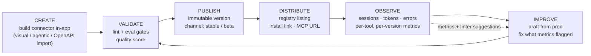
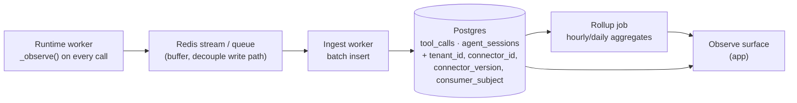
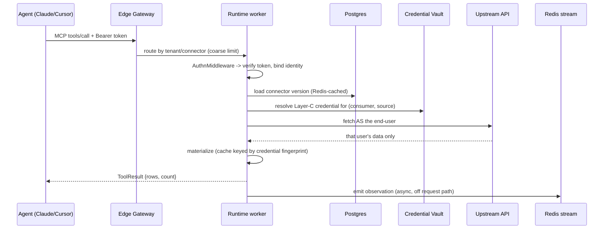

# Elliot — Cloud Technical Deployment & Connector Lifecycle Plan

> Status: technical implementation plan. Companion to
> [`CLOUD_DEPLOYMENT_AND_AUTH_PLAN.md`](./CLOUD_DEPLOYMENT_AND_AUTH_PLAN.md),
> which covers the identity / auth / isolation **architecture**. This document
> covers **how to deploy the platform** and the end-to-end **publisher
> lifecycle**: a user signs into the Elliot app, builds a connector,
> distributes it, keeps improving it, and gets Elliot's observability and
> quality benefits the whole time.
>
> Corresponds to `epic/10-cloud-platform` and `epic/11-connector-lifecycle`.

---

## 1. Scope

The auth plan answers *who is allowed to do what* and *how per-user upstream
data stays private*. This plan answers two different questions:

1. **Deployment** — the concrete infrastructure, services, data model, CI/CD,
   and runbook to stand the platform up and operate it.
2. **The lifecycle** — what a publisher actually does in the app:
   **create → validate → publish → distribute → improve**, with Elliot's
   observability and quality gates feeding every loop.

Where this plan needs an identity or credential concept (tenant, consumer,
`auth.binding`, credential vault) it uses the terms defined in the auth plan
and does not re-derive them.

---

## 2. The Product Loop

Everything below serves this loop. The publisher never leaves it; each pass
makes the connector better, and Elliot supplies the evidence.



The **observe → improve** edge is the heart of the request "Elliot gives him
observation metrics and the full Elliot benefits": real agent traffic produces
metrics, metrics produce concrete suggestions, and a new draft version closes
the loop — without the publisher guessing.

---

## 3. The Elliot App — What the User Logs Into

Today "Studio" is a local React SPA wired to localhost with a baked-in key.
In cloud it becomes **the app**: an authenticated, multi-tenant web product.

### 3.1 Onboarding

1. Sign up via the IdP (email/password or social) → an **Organization** is
   created with the user as Owner.
2. Guided first-run: "Connect your first data source" — pick REST / Postgres /
   MySQL / file, or paste an OpenAPI URL.
3. The app provisions a **builder workspace** (server-side, per user) and
   drops the user into the connector builder.

### 3.2 App surfaces

| Surface | Purpose | Backed by |
|---|---|---|
| **Build** | Author/edit a connector — visual editor + agentic builder + OpenAPI import | Builder service (today's `mcp-plugin`) |
| **Connectors** | List owned connectors, versions, channels, status | Control plane |
| **Registry** | Browse/install `org` + `public` connectors | Control plane |
| **Observe** | Sessions, token efficiency, error rates, per-version comparison | Observation store |
| **Evals** | Eval suites, run history, quality score trend | Control plane + eval runner |
| **Settings** | Members & roles, upstream credentials, tokens/PATs, billing | Control plane + vault |

The app keeps the existing Studio pages (Dashboard, Tools, Playground,
Metrics, Agent Console, Evaluation) as the **Build** and **Observe** surfaces —
they are reused, not rebuilt, but re-pointed from localhost to the hosted,
authenticated APIs (`studio/src/lib/http.ts` rework, per the auth plan).

---

## 4. Connector Lifecycle — Detailed

### 4.1 Create

Three entry paths, all producing the same `ConnectorConfig`
(`packages/core/src/elliot_core/types/connector.py`):

- **Visual editor** — the existing connector-editor UI (task 072): forms for
  sources, tools (filter/return model), parameters, skills. Live lint panel.
- **Agentic builder** — the existing `mcp-plugin` tool groups
  (`discover_source` → `build_connector` → `lint` → `eval` → `deploy`). In
  cloud the builder is authenticated and tenant-scoped; an agent (the user's
  Claude Code) connects to *their* builder workspace over an authenticated MCP
  URL.
- **OpenAPI import** — `openapi_analyzer.py` turns a spec into a
  `ProposedConnector` the user then refines.

The draft connector lives server-side (replacing local `.elliot/session.json`)
keyed by `(tenant, user)`, autosaved.

### 4.2 Validate

Publishing is **gated** — the same bar the `deploy` skill enforces today,
moved server-side:

| Gate | Tool | Pass condition |
|---|---|---|
| Lint | `elliot_lint_connector` / `linter.py` | 0 errors (warnings surfaced, not blocking by default) |
| Schema validate | `ConnectorConfig.model_validate` | valid |
| Secret hygiene | `secrets.check_secrets` + `SECRET_LITERAL` lint rule | no literal secrets in the file |
| Eval | `elliot eval` / `eval_runner.py` | all cases pass (if a suite exists) |
| Quality score | `quality_analyzer` | score ≥ org-configured threshold (default 80) |

The result is a **validation report** stored with the candidate version, shown
in the app before the publish button is enabled.

### 4.3 Publish & version

- A connector has **immutable, semver-tagged versions**. Publishing snapshots
  the validated `ConnectorConfig` + its validation report into the
  `connector_versions` table (and object storage for the blob).
- **Channels**: `stable` and `beta`. An install tracks a channel; the
  publisher promotes `beta → stable` when confident.
- A `draft` is the mutable working copy; publishing freezes it into a version
  and starts a fresh draft for the next iteration.
- Publishing never mutates a deployed version, so rollback is just
  "re-point the channel at the previous version" — no rebuild.

### 4.4 Distribute

What "distribute his connector" means concretely:

- **Visibility**: `private` (author), `org` (the org), `public` (registry).
- **Registry listing** (for `org`/`public`): name, description, the upstream
  auth requirement surfaced up front (`static` / `per_user` /
  `oauth2_delegated` — from the auth plan), version, quality score.
- **Install**: a consumer clicks Install → an `installs` row is created for
  their tenant and a connector-scoped token is minted. The app generates a
  copy-paste MCP client snippet:

  ```json
  { "mcpServers": { "<slug>": {
      "url": "https://run.elliot.dev/t/<tenant>/c/<connector>/mcp/",
      "authorization": "oauth"
  }}}
  ```

- If the connector has `per_user` / `oauth2_delegated` sources, the consumer
  is walked through "connect your account" before tools return data (auth
  plan §8).
- The publisher's existing connector keeps working while distributed — the
  consumer always resolves the channel's current version.

### 4.5 Improve

The iterate loop, with safety:

1. Publisher opens **Observe** for a connector → sees what real agents did.
2. Elliot surfaces concrete issues (Section 5.3): "tool `list_orders` averages
   1,400 tokens", "tool `get_ticket` errors 8% of calls".
3. Publisher clicks **"New draft from v1.3.0"** → a mutable draft seeded from
   the live version.
4. Fix in the visual/agentic builder; re-run lint + eval (Section 4.2).
5. Publish `v1.4.0` to `beta`; a subset of installs (or opt-in consumers) get
   it; compare `beta` vs `stable` metrics side by side (Section 5.4).
6. Promote to `stable`, or roll back instantly if `beta` regresses.

This is the "keep improving it" requirement: versioned drafts, gated
re-validation, channel-based gradual rollout, metric-driven diffs, one-click
rollback.

---

## 5. Observability & Metrics — The Publisher Benefit

"Elliot gives him observation metrics" — this section makes that concrete.

### 5.1 What is already captured (reuse)

The runtime already records, per tool call: `tool_id`, redacted `arguments`,
`result_row_count`, `result_token_estimate` (chars/4), `duration_ms`, `error`,
and the parsed agent identity (`client`, `client_version`, `model`,
`modality`) — into `tool_calls` / `agent_sessions`
(`observation_store.py`, `session_tracker.py`). `/v1/metrics/token-efficiency`
already aggregates avg/max tokens per tool and emits suggestions
(`_suggest()`).

The cloud work is **not** to invent metrics — it is to make this data
**multi-tenant, durable, queryable, and per-version**.

### 5.2 The metrics pipeline



Changes vs today:
- `_observe()` writes to a **Redis stream**, not a synchronous DB write on the
  request path — keeps tool latency low under load.
- An **ingest worker** batches into Postgres. Rows carry `tenant_id`,
  `connector_id`, `connector_version`, and pseudonymous `consumer_subject`.
- A **rollup job** maintains `metrics_tool_daily` / `metrics_connector_daily`
  aggregate tables so dashboards never scan raw `tool_calls`.
- NDJSON session/audit files (`.elliot/*.ndjson`) are dropped in cloud — they
  do not survive a container and are not tenant-safe.

### 5.3 What the publisher sees

| View | Metric | Source |
|---|---|---|
| Connector overview | sessions, total tool calls, error rate, avg tokens/call, p95 latency | `metrics_connector_daily` |
| Per-tool table | call count, avg/max tokens, avg duration, error count, **risk badge** + **suggestion** | `token_efficiency()` logic, per tenant/version |
| Agent console | live session tree: which agent, which model, every call, every error | `agent_sessions` + `tool_calls` |
| Error explorer | top error codes, sample (redacted) arguments, which tool/version | `tool_calls.error` |
| Quality trend | quality score over versions; lint/eval pass history | `connector_versions` reports |
| Adoption | installs over time, active consumers, calls per consumer | `installs`, `agent_sessions` |

### 5.4 The improvement feedback loop

This is the differentiator. Metrics are turned into **actions**:

- **Suggestions**: the existing `_suggest()` heuristics ("add LIMIT",
  "select fewer columns") are shown inline on the per-tool table and become
  one-click "open a draft to fix this".
- **Regression detection**: when a new version's per-tool avg tokens, error
  rate, or latency is worse than the previous version's by a threshold, the
  app flags it on the `beta` channel before promotion.
- **Version A/B**: `beta` vs `stable` metrics are shown side by side so the
  publisher promotes on evidence, not hope.
- **Eval from production**: a flagged real call can be captured (redacted) as
  a new eval case, so the next iteration is protected by a regression test.

### 5.5 Alerting

Per-connector, publisher-configurable: error rate > X%, p95 latency > Y,
upstream-auth failures spiking, quota near limit. Delivered by email / webhook.

---

## 6. Service Specification

| Service | From | Responsibility | State | Scaling |
|---|---|---|---|---|
| **Edge gateway** | new | TLS, WAF, routing, global rate limit | none | managed |
| **Elliot API** | new | accounts, orgs, RBAC, connector CRUD, registry, installs, tokens, billing, validation orchestration | Postgres | HPA on CPU |
| **OAuth Broker** | new | upstream OAuth authorize/callback/refresh; vault writes | Postgres + vault | low, HPA |
| **Builder** | `mcp-plugin` | authenticated agentic + visual connector authoring | server-side draft store | HPA, per-user workspace |
| **Connector Runtime** | `connector-runtime` | tool execution; per-request connector + credential resolution; emits observations | stateless | HPA on CPU + concurrency |
| **Ingest worker** | new | drain Redis stream → batch insert observations | none | HPA on queue depth |
| **Rollup/cron worker** | new | metric aggregates, retention prune, token refresh sweeps | none | 1–2 replicas |
| **Studio (app)** | `studio` | the web app (static assets) | none | CDN |

The two FastAPI/FastMCP services keep their internal structure; the changes
are: load connectors from Postgres not disk, resolve credentials per-request
from the vault not `os.environ`, fix the materialization-cache key (auth plan
§7.1), and emit observations to Redis not NDJSON.

---

## 7. API Surface

### 7.1 Control plane (Elliot API, REST + OIDC/JWT)

```
POST   /v1/orgs                          create org
GET    /v1/orgs/{id}/members             list members
POST   /v1/orgs/{id}/invites             invite member (role)
GET    /v1/connectors                    list owned connectors
POST   /v1/connectors                    create connector (draft)
GET    /v1/connectors/{id}/draft         get working draft
PUT    /v1/connectors/{id}/draft         update draft
POST   /v1/connectors/{id}/validate      run lint + eval + quality gates
POST   /v1/connectors/{id}/publish       freeze draft -> version (channel)
GET    /v1/connectors/{id}/versions      version history + reports
POST   /v1/connectors/{id}/channels      promote/rollback a channel
PATCH  /v1/connectors/{id}/visibility    private | org | public
GET    /v1/registry                      browse org + public connectors
POST   /v1/registry/{id}/install         install -> mint connector token
GET    /v1/connectors/{id}/metrics       overview / per-tool / per-version
GET    /v1/connectors/{id}/sessions      agent sessions (filterable)
POST   /v1/tokens                        mint a PAT (scoped)
DELETE /v1/tokens/{id}                   revoke
GET    /v1/usage                         metered usage for billing
```

### 7.2 Data plane

- **Builder**: MCP over HTTPS at `/t/{tenant}/builder/mcp/` (authenticated;
  the existing 8 tool groups).
- **Runtime**: MCP over HTTPS at `/t/{tenant}/c/{connector}/mcp/`, plus the
  OpenAI-compatible `/v1/chat/completions`. Health: `/health`, `/v1/health`.
- OAuth discovery: `/.well-known/oauth-protected-resource` (auth plan §5.3).

---

## 8. Data Model (Postgres)

Control-plane sketch — every tenant-scoped table also gets a Row-Level
Security policy keyed on `tenant_id`.

```sql
CREATE TABLE organizations (
  id            uuid PRIMARY KEY,
  name          text NOT NULL,
  plan          text NOT NULL DEFAULT 'free',
  created_at    timestamptz NOT NULL DEFAULT now()
);

CREATE TABLE users (
  id            uuid PRIMARY KEY,
  idp_subject   text UNIQUE NOT NULL,        -- from the OIDC provider
  email         text NOT NULL,
  created_at    timestamptz NOT NULL DEFAULT now()
);

CREATE TABLE memberships (
  org_id        uuid REFERENCES organizations(id),
  user_id       uuid REFERENCES users(id),
  role          text NOT NULL,               -- owner|admin|author|member|billing
  PRIMARY KEY (org_id, user_id)
);

CREATE TABLE connectors (
  id            uuid PRIMARY KEY,
  tenant_id     uuid NOT NULL REFERENCES organizations(id),
  slug          text NOT NULL,
  visibility    text NOT NULL DEFAULT 'private',
  created_by    uuid REFERENCES users(id),
  created_at    timestamptz NOT NULL DEFAULT now(),
  UNIQUE (tenant_id, slug)
);

CREATE TABLE connector_drafts (
  connector_id  uuid PRIMARY KEY REFERENCES connectors(id),
  config        jsonb NOT NULL,              -- working ConnectorConfig
  updated_at    timestamptz NOT NULL DEFAULT now()
);

CREATE TABLE connector_versions (
  id            uuid PRIMARY KEY,
  connector_id  uuid NOT NULL REFERENCES connectors(id),
  semver        text NOT NULL,
  config        jsonb NOT NULL,              -- immutable snapshot
  blob_uri      text,                        -- object storage copy
  validation    jsonb NOT NULL,              -- lint/eval/quality report
  quality_score int,
  published_by  uuid REFERENCES users(id),
  published_at  timestamptz NOT NULL DEFAULT now(),
  UNIQUE (connector_id, semver)
);

CREATE TABLE connector_channels (
  connector_id  uuid REFERENCES connectors(id),
  channel       text NOT NULL,               -- stable | beta
  version_id    uuid REFERENCES connector_versions(id),
  PRIMARY KEY (connector_id, channel)
);

CREATE TABLE installs (
  id            uuid PRIMARY KEY,
  connector_id  uuid NOT NULL REFERENCES connectors(id),
  consumer_org  uuid NOT NULL REFERENCES organizations(id),
  channel       text NOT NULL DEFAULT 'stable',
  created_at    timestamptz NOT NULL DEFAULT now()
);

CREATE TABLE api_tokens (
  id            uuid PRIMARY KEY,
  tenant_id     uuid NOT NULL REFERENCES organizations(id),
  user_id       uuid REFERENCES users(id),
  connector_id  uuid REFERENCES connectors(id),   -- null = org-wide
  token_hash    text NOT NULL,                    -- hash only
  scopes        text[] NOT NULL,
  expires_at    timestamptz,
  revoked_at    timestamptz
);
```

Observation tables = today's `agent_sessions` / `tool_calls` plus
`tenant_id`, `connector_id`, `connector_version`, `consumer_subject`, with
indexes on `(tenant_id, connector_id, ts)`; aggregate tables
`metrics_tool_daily`, `metrics_connector_daily` are maintained by the rollup
job. Upstream-credential metadata lives in a `credentials` table; the
ciphertext lives in the vault (auth plan §8.2).

---

## 9. Infrastructure & Deployment

### 9.1 Environments

`dev` → `staging` → `prod`, identical topology, separate data stores and
secrets. `ELLIOT_ENV` already gates dev-key behaviour; cloud always runs in
the non-dev branch.

### 9.2 Infrastructure as code (Terraform)

Modules: `network` (VPC, subnets, NAT for controlled egress), `database`
(managed Postgres, primary + read replica, automated backups, RLS-ready),
`cache` (managed Redis), `objectstore` (bucket, lifecycle rules), `kms`
(master key + per-tenant DEK policy), `cluster` (Kubernetes), `dns_tls`
(domains, managed certs), `gateway` (ingress + WAF), `observability`
(log + metric + trace pipeline).

### 9.3 Kubernetes

One Helm chart per service: `Deployment` + `Service` + `HPA` +
`PodDisruptionBudget` + `NetworkPolicy`. Reuse the existing multi-stage,
non-root Dockerfiles for `mcp-plugin` / `connector-runtime` / `studio`; add
Dockerfiles for the new API, broker, and workers. Per-service liveness uses
the existing `/health`; readiness gates on DB/Redis connectivity.

### 9.4 CI/CD

Extend the existing GitHub Actions CI (`ruff`, `ruff format`, `mypy`,
`pytest`, studio `typecheck` + `vitest` + build, `pip-audit`) into CD:

```
lint+typecheck+test  →  build & sign images  →  push to registry
   →  deploy staging  →  run DB migrations (gated job)  →  smoke tests
   →  manual approval →  deploy prod (blue-green / canary)  →  smoke tests
```

Migrations run as a dedicated, gated step (Alembic), never implicitly at app
boot — replacing the runtime's current `_Base.metadata.create_all` /
ad-hoc `ALTER TABLE` in `observation_store.py`.

### 9.5 Secrets injection

Infra/app secrets (DB URL, Redis URL, JWT signing key refs, IdP client
secrets) come from the secrets manager and are mounted/injected at deploy
time. No `.env` files in images. Upstream end-user credentials never touch
this path — they live in the vault and are fetched per request.

### 9.6 First-deploy runbook

1. `terraform apply` the `dev` workspace → network, DB, Redis, bucket, KMS,
   cluster.
2. Seed secrets in the secrets manager; register the OIDC IdP application.
3. Run the migration job → control-plane + observation schema, RLS policies.
4. `helm install` each service to `dev`; verify `/health` + readiness.
5. Smoke test: sign up → create org → build a trivial connector → validate →
   publish → install → call a tool over MCP → confirm a row lands in
   `tool_calls` and shows in **Observe**.
6. Promote the same artifacts through `staging` then `prod` via the CD
   pipeline; first prod deploy uses blue-green.

---

## 10. Configuration Reference (cloud)

Per-service env, sourced from the secrets manager (illustrative):

| Service | Key vars |
|---|---|
| Elliot API | `DATABASE_URL`, `REDIS_URL`, `OIDC_ISSUER`, `OIDC_CLIENT_ID/SECRET`, `JWT_SIGNING_KEY_REF`, `KMS_KEY_REF` |
| OAuth Broker | `DATABASE_URL`, `VAULT_*`, `BROKER_CALLBACK_BASE_URL` |
| Builder | `DATABASE_URL`, `OIDC_*` / token verification config, `DRAFT_STORE_URL` |
| Runtime | `DATABASE_URL` (read), `REDIS_URL`, `VAULT_*`, `OBSERVATION_STREAM`, `ELLIOT_RATE_LIMIT`, `ELLIOT_MAX_REQUEST_BODY_BYTES`, `OTEL_EXPORTER_OTLP_ENDPOINT` |
| Ingest / rollup | `DATABASE_URL`, `REDIS_URL` |

Deployment-wide `ELLIOT_API_KEY` / `VITE_API_KEY` are **removed** in cloud
(kept only for the OSS single-tenant path).

---

## 11. Request Lifecycle in Production

One consumer tool call, end to end:



The ingest worker later drains `RS` into `tool_calls`; the rollup job
aggregates; the publisher sees it in **Observe**.

---

## 12. Operations

- **SLOs**: tool-call p95 latency target, API availability target, ingest lag
  < 1 min. Tracked on dashboards fed by OTel (already wired when
  `OTEL_EXPORTER_OTLP_ENDPOINT` is set).
- **Monitoring**: per-tenant QPS, error rate, latency, upstream failure rate,
  queue depth, DB connections, vault decrypt rate.
- **Backup/DR**: automated Postgres backups + PITR; object-storage
  versioning; KMS keys multi-region; documented restore drill.
- **Retention**: observation retention becomes a per-tenant policy (today's
  fixed 30-day prune generalised); the rollup worker enforces it.
- **Incident runbook**: per-service dashboards, log search by
  `tenant_id` / `connector_id` / `session_id`, token revocation, channel
  rollback as the fast connector-level mitigation.
- **Capacity**: scale runtime on CPU + concurrency, ingest on queue depth;
  Postgres read replica absorbs metrics queries; per-tenant quotas cap
  blast radius.

---

## 13. Build Sequence

Each milestone is shippable and leaves the platform working. M0–M3 align with
the auth plan's Phases 0–3; M4–M6 deliver the lifecycle.

| Milestone | Delivers | Lifecycle stage unlocked |
|---|---|---|
| **M0 Foundations** | Postgres/Redis/object store/KMS; Terraform; CD skeleton; connectors + observations off local disk | infra ready |
| **M1 Accounts** | Elliot API; OIDC login; orgs/RBAC; app re-pointed off `VITE_API_KEY` | sign in, workspaces |
| **M2 Tenancy & runtime** | per-request connector/credential resolution; `tenant_id` + RLS; **materialization-cache fix**; observations to Redis→Postgres | safe shared runtime |
| **M3 Lifecycle core** | drafts, validate gates, immutable versions, channels, rollback | **create → validate → publish → improve** |
| **M4 Distribution** | registry, visibility, installs, hosted MCP URLs + install snippets | **distribute** |
| **M5 Observability** | metrics pipeline, ingest/rollup workers, Observe surface per-tool/per-version, suggestions, A/B, alerts | **observe → improve loop** |
| **M6 Per-user upstream + scale** | `auth.binding` modes, credential vault, OAuth broker, quotas, billing, retention policy | per-user data; production scale |

The user's request — "make their connector and distribute it while they keep
improving it, and Elliot gives observation metrics" — is fully met at the end
of **M5**. **M6** adds per-end-user upstream data (auth plan §8) and
production-scale operations.

---

## 14. Acceptance Criteria

The platform is "done" for the requested scope when:

- A new user can sign up, create an org, and build a connector entirely in the
  app — no `make dev`, no local install.
- Publishing is blocked unless lint, schema, secret-hygiene, eval, and quality
  gates pass; the report is visible.
- A published connector is installable by another tenant via a copy-paste MCP
  snippet, and its tools work in a real agent.
- Every tool call by a consumer's agent appears in the publisher's **Observe**
  surface within a minute, attributed to connector + version + (pseudonymous)
  consumer, with tokens, latency, and errors.
- The publisher can open a draft from a live version, fix a
  metric-flagged issue, re-validate, publish to `beta`, compare against
  `stable`, and promote or roll back in one click.
- Two tenants sharing a runtime cannot observe each other's connectors,
  metrics, credentials, or materialized data.
