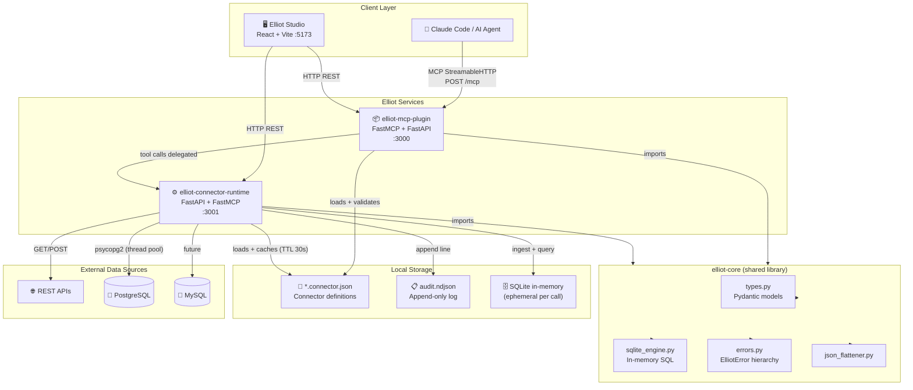
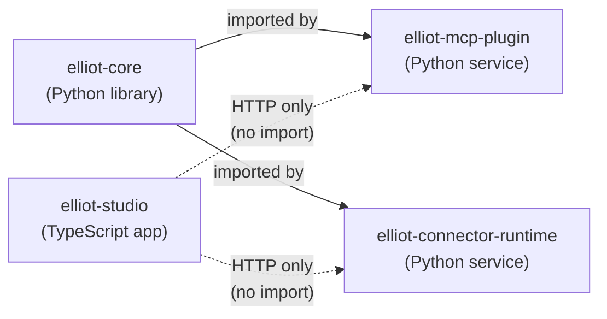
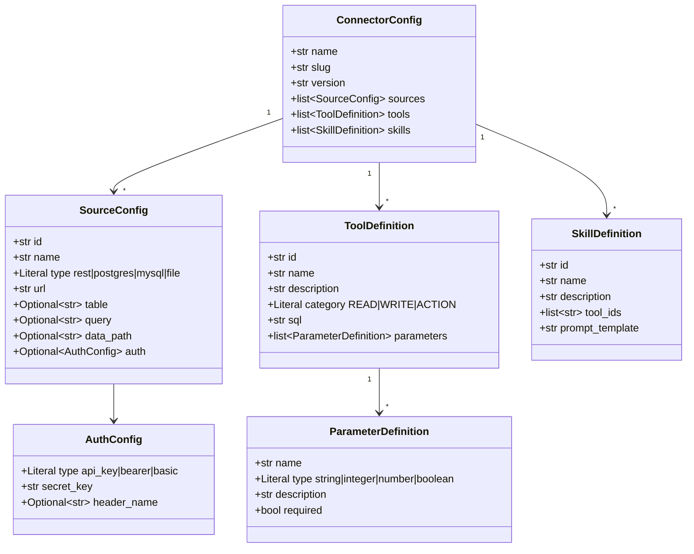

# Elliot — Full System Architecture

## System Overview



---

## Package Dependency Graph



---

## Port Map & Environment Variables

| Service | Port | Entry Point | Key Env Vars |
|---|---|---|---|
| `elliot-studio` | 5173 | `vite dev` | `VITE_PLUGIN_URL`, `VITE_RUNTIME_URL` |
| `elliot-mcp-plugin` | 3000 | `uvicorn elliot_mcp_plugin.server:app` | `ELLIOT_CONNECTORS_DIR`, `LOG_LEVEL` |
| `elliot-connector-runtime` | 3001 | `uvicorn elliot_connector_runtime.server:app` | `ELLIOT_CONNECTOR`, `ELLIOT_AUDIT_LOG`, `LOG_LEVEL` |

---

## Directory Structure

```
elliot/
├── packages/
│   ├── core/                          # elliot-core
│   │   └── src/elliot_core/
│   │       ├── types.py               # ConnectorConfig, ToolDefinition, …
│   │       ├── sqlite_engine.py       # SQLiteEngine: ingest + query
│   │       ├── errors.py              # ElliotError base class
│   │       └── json_flattener.py      # Nested JSON → flat rows
│   │
│   ├── mcp-plugin/                    # elliot-mcp-plugin
│   │   └── src/elliot_mcp_plugin/
│   │       ├── server.py              # create_app() → FastAPI + FastMCP :3000
│   │       ├── session.py             # ElliotSession: per-connector MCP session
│   │       ├── tools/
│   │       │   ├── source_tools.py    # MCP tools for source listing
│   │       │   ├── sql_tools.py       # MCP tools for SQL execution
│   │       │   ├── skill_runner.py    # MCP tools for skill execution
│   │       │   └── context_tools.py   # Connector meta-tools
│   │       ├── logging_config.py      # structlog JSON setup
│   │       └── error_middleware.py    # ElliotError → HTTP JSON
│   │
│   ├── connector-runtime/             # elliot-connector-runtime
│   │   └── src/elliot_connector_runtime/
│   │       ├── server.py              # create_app() → FastAPI + FastMCP :3001
│   │       ├── loader.py              # load_connector(), ConnectorLoadError
│   │       ├── cache.py               # ConnectorCache (TTL + mtime)
│   │       ├── executor.py            # ToolExecutor: fetch + SQL
│   │       ├── audit.py               # AuditLog (NDJSON, thread-safe)
│   │       ├── protocols/
│   │       │   └── openai.py          # /v1/chat/completions endpoint
│   │       ├── logging_config.py
│   │       └── error_middleware.py
│   │
│   └── studio/                        # elliot-studio
│       └── src/
│           ├── main.tsx
│           ├── store/                 # Zustand state
│           ├── client/                # MCP HTTP client
│           └── pages/
│               ├── Dashboard.tsx      # Sources overview
│               ├── Tools.tsx          # Tool browser + runner
│               ├── Skills.tsx         # Skill browser
│               ├── Playground.tsx     # Interactive tool tester
│               └── Metrics.tsx        # Audit log viewer
│
├── tasks/                             # Implementation task specs
│   ├── 01-monorepo-setup/
│   ├── 02-core-library/
│   ├── 03-mcp-plugin/
│   ├── 04-connector-runtime/
│   ├── 05-studio-ui/
│   ├── 06-eval-and-polish/
│   └── 07-dx-and-observability/
│
├── docs/                              # This folder
├── Procfile                           # honcho / foreman dev runner
├── pyproject.toml                     # uv workspace root
└── package.json                       # pnpm workspace root
```

---

## Connector File Schema


