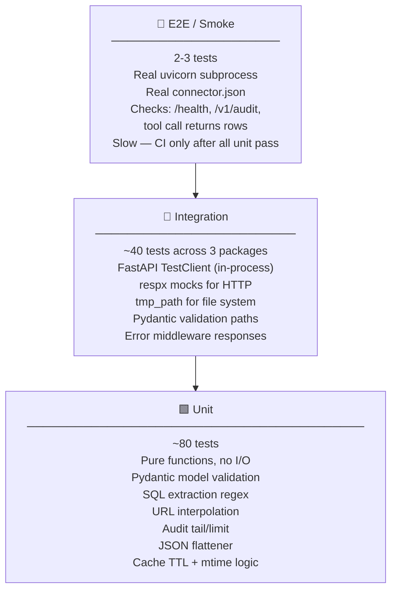
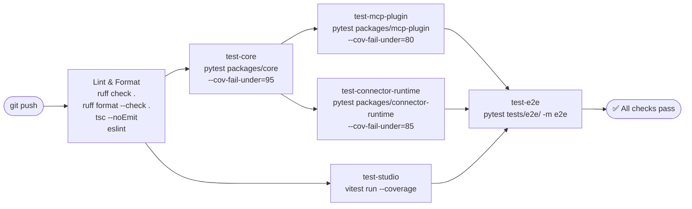
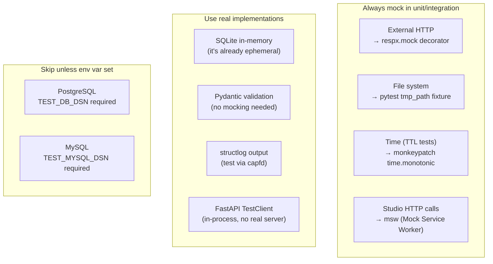

# Elliot — Test Plan & Quality Strategy

## Test Pyramid



---

## Per-Package Coverage Gates

```mermaid
gantt
    title Coverage Targets by Package
    dateFormat X
    axisFormat %s%%

    section elliot-core
    types.py          :0, 100
    sqlite_engine.py  :0, 100
    errors.py         :0, 100
    json_flattener.py :0, 95

    section connector-runtime
    loader.py  :0, 100
    audit.py   :0, 100
    cache.py   :0, 90
    executor.py (REST path) :0, 85
    server.py  :0, 80

    section mcp-plugin
    session.py      :0, 85
    tools/          :0, 80
    server.py       :0, 75

    section studio (lines)
    store/   :0, 80
    client/  :0, 75
    pages/   :0, 65
```



| Package | Gate | Excludes |
|---|---|---|
| `elliot-core` | **95%** | — |
| `elliot-connector-runtime` | **85%** | `_query_postgres` (needs real DB) |
| `elliot-mcp-plugin` | **80%** | MCP transport internals |
| `elliot-studio` | **70% lines** | Generated code, `main.tsx` |

---

## Test Matrix

### `elliot-core`

| Test | Type | File | What it checks |
|---|---|---|---|
| `test_connector_config_valid` | Unit | `test_types.py` | Full valid connector parses |
| `test_connector_config_missing_slug` | Unit | `test_types.py` | Pydantic raises on missing required field |
| `test_source_config_auth_optional` | Unit | `test_types.py` | auth=None is valid |
| `test_sqlite_ingest_flat` | Unit | `test_sqlite.py` | Flat list ingested as table |
| `test_sqlite_ingest_nested` | Unit | `test_sqlite.py` | Nested JSON flattened before ingest |
| `test_sqlite_query_with_params` | Unit | `test_sqlite.py` | `:param` binding works |
| `test_sqlite_empty_result` | Unit | `test_sqlite.py` | Returns [] not error |
| `test_flatten_nested_dict` | Unit | `test_flattener.py` | `{a: {b: 1}}` → `{a_b: 1}` |
| `test_flatten_list_of_dicts` | Unit | `test_flattener.py` | Each dict flattened independently |
| `test_elliot_error_code` | Unit | `test_errors.py` | Subclass carries correct `.code` |

### `elliot-connector-runtime`

| Test | Type | File | What it checks |
|---|---|---|---|
| `test_load_connector_ok` | Unit | `test_loader_cache.py` | Valid JSON + schema → ConnectorConfig |
| `test_load_connector_missing` | Unit | `test_loader_cache.py` | Missing file → ConnectorLoadError |
| `test_load_connector_bad_json` | Unit | `test_loader_cache.py` | Broken JSON → ConnectorLoadError |
| `test_cache_returns_same_object` | Unit | `test_loader_cache.py` | Second get = same object (is) |
| `test_cache_mtime_invalidation` | Unit | `test_loader_cache.py` | File updated → new object loaded |
| `test_cache_ttl_expiry` | Unit | `test_loader_cache.py` | TTL=0.01 → new object after sleep |
| `test_executor_rest_source` | Integration | `test_executor.py` | respx mock → rows returned |
| `test_executor_empty_result` | Integration | `test_executor.py` | Empty API response → [] |
| `test_extract_table_names` | Unit | `test_executor.py` | FROM + JOIN parsed correctly |
| `test_interpolate_url` | Unit | `test_executor.py` | `{param}` replaced in URL |
| `test_audit_record_and_tail` | Unit | `test_runtime_integration.py` | record + tail returns entries |
| `test_audit_tail_empty` | Unit | `test_runtime_integration.py` | Missing file → [] |
| `test_audit_tail_limit` | Unit | `test_runtime_integration.py` | tail(5) returns last 5 |
| `test_health` | Integration | `test_runtime_integration.py` | GET /health → 200 + {status:ok} |
| `test_audit_endpoint` | Integration | `test_runtime_integration.py` | GET /v1/audit → 200 + list |
| `test_openai_tools_schema` | Integration | `test_runtime_integration.py` | tools schema correct shape |
| `test_executor_full_flow` | Integration | `test_runtime_integration.py` | respx → rows via full stack |
| `test_loader_schema_validation_error` | Integration | `test_runtime_integration.py` | Bad schema → ConnectorLoadError |
| `test_elliot_error_returns_404` | Integration | `test_error_middleware.py` | NOT_FOUND error → 404 |
| `test_generic_error_returns_500` | Integration | `test_error_middleware.py` | RuntimeError → 500 |

### `elliot-mcp-plugin`

| Test | Type | File | What it checks |
|---|---|---|---|
| `test_health` | Integration | `test_server.py` | GET /health → 200 |
| `test_mcp_tools_list` | Integration | `test_session.py` | MCP tools/list returns tool list |
| `test_source_tool_descriptor` | Unit | `test_source_tools.py` | MCP tool has correct schema |
| `test_sql_tool_descriptor` | Unit | `test_sql_tools.py` | SQL params → MCP input schema |
| `test_build_flow` | Integration | `test_build_flow.py` | Full build: load → register → list |

### `elliot-studio` (TypeScript)

| Test | Type | File | What it checks |
|---|---|---|---|
| `store initial state` | Unit | `store.test.ts` | All fields at defaults |
| `setConnector updates slug` | Unit | `store.test.ts` | Zustand mutation works |
| `client lists tools` | Unit | `mcpClient.test.ts` | msw mock → tools array |
| `client handles 500` | Unit | `mcpClient.test.ts` | Error stored in state |
| `SourceCard renders type badge` | Component | `SourceCard.test.tsx` | REST badge visible |
| `ToolRow shows category badge` | Component | `ToolRow.test.tsx` | READ badge visible |
| `Playground submits and shows result` | Component | `Playground.test.tsx` | Form submit → table rendered |
| `AuditTable filters by tool name` | Component | `AuditTable.test.tsx` | Filter input → rows filtered |

---

## CI Pipeline



---

## Mocking Strategy



---

## Test Fixtures (shared `conftest.py`)

```python
# packages/connector-runtime/tests/conftest.py
import json, pytest
from pathlib import Path
from fastapi.testclient import TestClient
from elliot_connector_runtime.server import create_app

MINIMAL_CONNECTOR = {
    "name": "Pets", "slug": "pets", "version": "1.0.0",
    "sources": [{"id": "animals", "name": "Animals API",
                 "type": "rest", "url": "https://api.example.com/animals",
                 "data_path": "items"}],
    "tools": [{"id": "list_animals", "name": "List animals",
               "description": "Return all animals", "category": "READ",
               "sql": "SELECT * FROM animals", "parameters": []}],
    "skills": [],
}

@pytest.fixture(scope="session")
def connector_file(tmp_path_factory):
    p = tmp_path_factory.mktemp("conn") / "pets.connector.json"
    p.write_text(json.dumps(MINIMAL_CONNECTOR))
    return p

@pytest.fixture(scope="session")
def app(connector_file):
    return create_app(connector_path=str(connector_file), secrets={})

@pytest.fixture(scope="session")
def client(app):
    return TestClient(app)
```

---

## Running Tests Locally

```bash
# All Python tests with coverage
uv run pytest packages/core/tests/             --cov=elliot_core              --cov-fail-under=95  -v
uv run pytest packages/connector-runtime/tests/ --cov=elliot_connector_runtime --cov-fail-under=85  -v
uv run pytest packages/mcp-plugin/tests/        --cov=elliot_mcp_plugin        --cov-fail-under=80  -v

# Studio tests
cd packages/studio && npx vitest run --coverage

# E2E only (slow, needs running services)
uv run pytest tests/e2e/ -m e2e -v

# Everything at once from repo root
uv run pytest packages/ --ignore=tests/e2e -v
```
