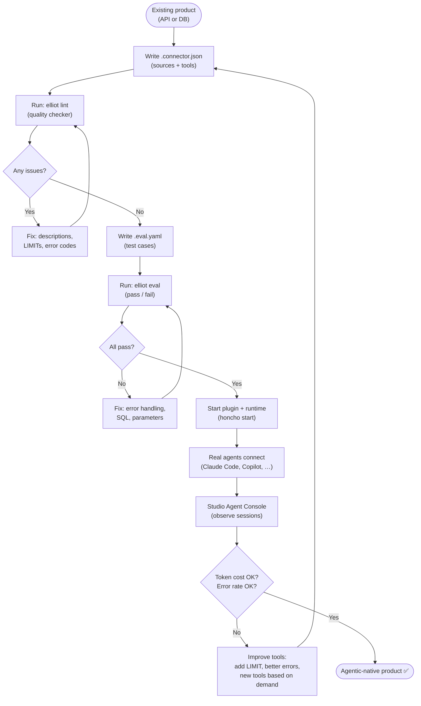

# Elliot — User Stories & Personas

## The Real User

**A product engineer who already has a working API or database and wants to make it genuinely usable by AI agents — not just callable, but designed so agents understand it, use it efficiently, and get good answers.**

This person is not building an AI product. They are building a normal SaaS, internal tool, or data service. They want to add AI as a first-class consumer of their product’s capabilities without rewriting anything.

---

## The Core Problem

Connecting an API to Claude is easy. Making that API *work well* with agents is hard.

Agents fail in predictable ways when tools are poorly designed:
- They call the wrong tool because descriptions are vague
- They pass wrong parameter types because names are ambiguous
- They get confused by 500-row results that fill their context window
- They give up after an error because the error message says nothing actionable
- They retry in circles because there’s no tool for what they actually need

Elliot’s job is to make these problems visible and fixable.

---

## Persona 1 — Alex, Backend Engineer

> “I have a REST API. I want Claude Code to query it without me writing a wrapper every time. But I also want to know if Claude is using it correctly.”

**Situation**: 3-year-old SaaS product with a solid REST API. Team uses Claude Code daily. Colleagues ask Claude data questions. Claude guesses or says it can’t access the data.

**Journey with Elliot**:

```
Week 1: First connector
  └ Write pets.connector.json: 3 sources, 5 tools
  └ Run elliot lint → 2 warnings (unbounded SELECT, vague description)
  └ Fix both warnings
  └ Start plugin + runtime
  └ Ask Claude: "list all open tickets assigned to me" → real data

Week 2: Check how Claude is actually using the tools
  └ Open Studio → Agent Console
  └ See: Claude called list_all_tickets → got 847 rows → 1,200 tokens used
  └ Elliot flags: "this tool returned > 500 tokens, consider adding LIMIT"
  └ Alex adds status_filter parameter and LIMIT 50 default
  └ Next session: 12 rows, 89 tokens

Week 3: Validate before shipping to the team
  └ Write tickets.eval.yaml: 8 test cases
  └ uv run elliot eval tickets.eval.yaml → 7/8 pass
  └ 1 failure: get_ticket with bad ID returns 500 instead of NOT_FOUND error
  └ Alex fixes error handling in executor
  └ 8/8 pass → connector is ready for the team
```

**Success for Alex**: Claude uses Alex’s tools efficiently and correctly. Alex knows this because he can see every session.

---

## Persona 2 — Maria, Solo Founder

> “I have a PostgreSQL database with all my business data. I want Claude to help me run my company — answer questions, spot patterns, flag anomalies — without me switching between apps.”

**Situation**: Solo B2B SaaS, ~200 customers. All business data in PostgreSQL. Uses Claude Code for dev but data questions require a separate DB GUI. Breaks her flow constantly.

**Journey with Elliot**:

```
Day 1: Connect the database
  └ Write my-saas.connector.json
  └ PostgreSQL source: users, subscriptions, events tables
  └ Define 4 tools: churned_customers, mrr_by_plan, new_signups, feature_adoption
  └ Store DB password in .env (never in connector file)
  └ Run linter → 1 warning: "churned_customers has no LIMIT, may return many rows"
  └ Add: LIMIT 100 ORDER BY last_active_at ASC

Day 2+: Daily use
  └ Morning: "any new signups overnight?" → Claude calls new_signups({hours_ago: 8})
  └ "Which plan has most churn?" → Claude calls churned_customers + mrr_by_plan
  └ Claude reasons across both results → answer in 10 seconds

Weekly: Check the Agent Console
  └ See which tools Claude uses most
  └ Notice: feature_adoption was called 12 times, always with no params → returns too much
  └ Add date_from parameter with default = 30 days ago
  └ Token cost drops from 890 to 120 per call
```

**Success for Maria**: Business decisions take seconds. She never leaves her dev environment for data questions.

---

## Persona 3 — Team Lead, Mid-size Company

> “I want any agent — Claude Code, Copilot, whatever the team uses — to be able to use our internal API as a first-class data source. And I want to know if the tools are actually good enough.”

**Situation**: Team of 8. Shared internal API. The PM can’t query the DB themselves. Every data question is an interrupt for an engineer.

**Journey with Elliot**:

```
Team setup (half a day)
  └ Engineer writes shared-api.connector.json, commits to repo
  └ Secrets in team .env, connector file has no secrets
  └ Run linter → clean
  └ Write shared-api.eval.yaml with 12 test cases covering all tools
  └ All 12 pass → merge to main
  └ .mcp.json already in repo → every team member gets tools automatically

PM daily use
  └ Asks Claude: "what’s our weekly active user trend for the last month?"
  └ Claude calls weekly_active_users({weeks: 4})
  └ Gets structured result → Claude formats it as a trend summary
  └ PM shares in Slack with confidence — no engineer involved

Team lead monthly review
  └ Opens Studio Agent Console → filters by last 30 days
  └ Sees: 47 agent sessions, 0 errors, avg 94 tokens per call
  └ Notices: users asked about churn 18 times but no churn tool exists
  └ Adds churned_customers tool → writes 2 eval cases → merges
```

**Success**: The team builds tools based on what agents actually need, not what engineers guess they might need.

---

## The Full Experience: From API to Agentic Product



---

## What “Good Enough” Looks Like

The developer knows their connector is agent-ready when:

| Signal | Good | Needs work |
|---|---|---|
| Linter | 0 errors, 0 warnings | Any ERROR or WARNING |
| Eval pass rate | 100% | < 100% |
| Avg tokens per call | < 300 | > 500 |
| Error rate (Agent Console) | < 2% | > 5% |
| Token cost per session | < 1,000 | > 3,000 |
| Tool call retries (same tool, same session) | 0 | ≥ 1 (agent confused) |
