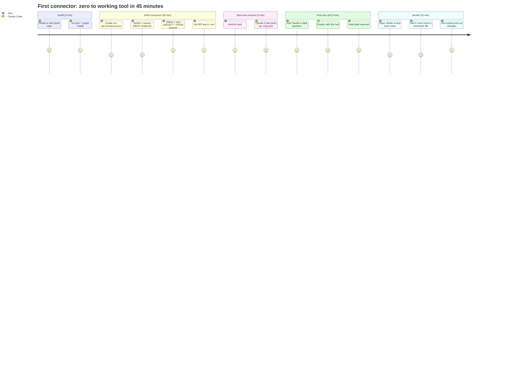

# Elliot — User Stories & Personas

## Who is Elliot for?

Elliot is for **developers who already have a working product** — an API, a database, an internal tool — and want Claude Code (or any AI coding agent) to be able to query and act on that product’s data *without* building a custom integration from scratch every time.

The user is not a data engineer. They are not an AI researcher. They are a **product engineer** who wants their existing backend to become AI-callable in under an hour.

---

## Persona 1 — Alex, Backend Engineer at a SaaS startup

> “We have a solid REST API. I just want Claude to be able to query it without me writing a wrapper every time.”

**Situation**: Alex’s company has a 3-year-old product with a REST API. The team has started using Claude Code for development tasks. Colleagues keep asking Claude things like “how many users signed up last week?” or “list the open support tickets” — and Claude either hallucinates answers or says it can’t access the data.

**Pain**: Every time someone wants Claude to use real data, Alex has to either paste API responses manually into the chat or write a custom script. It’s slow, error-prone, and doesn’t scale.

**What Alex needs**:
- A way to expose 5–10 of the most-used API endpoints as named tools Claude can call
- Parameters that filter results (date ranges, user IDs, status filters)
- No cloud service to configure, no vendor lock-in
- Results Claude can reason about — not raw JSON dumps

**How Alex uses Elliot**:

```
Day 1 (45 minutes)
  1. Installs Elliot MCP plugin into Claude Code
  2. Writes pets.connector.json: 3 REST sources, 5 tools
  3. Starts elliot-mcp-plugin
  4. Asks Claude: "list all open tickets assigned to me"
  5. Claude calls list_tickets({assignee: "alex", status: "open"})
  6. Gets real data back. Done.

Day 2+
  - Adds more tools as the team asks for them
  - Opens Studio to test new tools before sharing with the team
  - Checks the audit log when a tool returns unexpected results
```

**Success for Alex**: Claude can answer data questions about the product in real time. Alex stops being the manual data pipeline.

---

## Persona 2 — Maria, Solo Founder / Indie Developer

> “I built my product alone. I need Claude to help me run it — understand the data, spot anomalies, help me make decisions.”

**Situation**: Maria runs a small B2B SaaS with ~200 customers. She manages everything herself: support, analytics, billing, deployment. She uses Claude Code heavily for development but the moment she needs to ask a business question — “which customers haven’t logged in for 30 days?” — she’s back to writing SQL queries manually in a database GUI.

**Pain**: She has a PostgreSQL database with all her business data. She knows SQL. But switching context between Claude and her DB GUI breaks her flow. She wants to stay in one place.

**What Maria needs**:
- Connect directly to her PostgreSQL database (not a REST API)
- Define tools that answer her most common business questions
- Be able to ask those questions in natural language inside Claude Code
- Trust that Claude is calling real tools, not guessing

**How Maria uses Elliot**:

```
Initial setup (1 hour)
  1. Creates my-saas.connector.json
  2. Adds PostgreSQL source: "users", "subscriptions", "events" tables
  3. Defines tools:
     - churned_customers (inactive 30+ days)
     - mrr_by_plan
     - users_by_signup_cohort
  4. Stores DB password in env var, never in the connector file

Daily usage
  - Morning: asks Claude "any new signups overnight?"
  - Claude calls new_signups({hours_ago: 8}) — real result
  - "Which plan has the most churn this month?"
  - Claude calls churned_customers + mrr_by_plan, reasons across both
  - Maria gets an answer in 10 seconds instead of 5 minutes

Monthly
  - Adds a new tool when a new business question becomes recurring
  - Reviews audit log to see which tools Claude uses most
```

**Success for Maria**: Her database becomes conversational. She makes faster business decisions without leaving her development environment.

---

## Persona 3 — Dev Team Lead at a mid-size company

> “I want the whole team to be able to ask data questions through Claude, not just the engineers who know SQL.”

**Situation**: A team of 8. Engineers, a PM, a designer. The engineers can query the DB themselves but the PM and designer can’t. Whenever they need data for a decision, they ask an engineer, who context-switches and runs a query. This is a constant interrupt tax on the engineering team.

**Pain**: The data exists. The API exists. But access is gated behind engineering knowledge. The team lead wants to democratise it — let everyone ask questions through Claude.

**What the team lead needs**:
- A connector that the team shares (checked into git)
- Tools that are safe for non-engineers to call (read-only, well-named, with good descriptions)
- A Studio UI where anyone can test a tool without touching the terminal
- An audit log so they can see what’s being queried

**How the team uses Elliot**:

```
Team setup (half a day)
  1. Engineer writes shared-api.connector.json
  2. Commits it to the repo (no secrets in the file)
  3. Adds ELLIOT_API_KEY to the team’s shared .env
  4. Documents 3 commands in the team wiki:
     honcho start ← starts all services
     open http://localhost:5173 ← Studio
     .mcp.json already in repo ← Claude Code auto-picks it up

PM usage (daily)
  - Opens Claude Code, asks: "what’s our weekly active user trend?"
  - Claude calls weekly_active_users() — live data, no engineer involved
  - PM shares the answer in Slack with confidence

Designer usage
  - Opens Studio, goes to Playground
  - Selects "feature_adoption" tool, runs it with different parameters
  - Gets a table they can paste into Figma annotations

Engineer usage
  - Adds a new tool when the PM asks a question that isn’t covered yet
  - Reviews audit log on Friday to see what the team asked most
```

**Success for the team lead**: The engineering team answers fewer data questions in Slack. The PM and designer are unblocked. Data questions take seconds, not hours.

---

## The First-Time Experience (step by step)



---

## What the User Sees in Studio

### Dashboard page
A card for each source in the connector. Each card shows:
- Source name and type badge (`REST` / `PostgreSQL`)
- Auth status (key present ✓ or missing ⚠)
- URL or connection string (masked)

The user sees at a glance whether their connector is correctly configured.

### Tools page
A list of all tools with their category badge (`READ` / `WRITE` / `ACTION`). Clicking a tool:
- Shows the description
- Shows the parameter form (auto-generated from the tool definition)
- Shows the SQL query in a collapsible panel
- Has a **Run** button that calls the live runtime and shows the result as a table

The user can verify that a tool works before trusting Claude to call it.

### Playground page
A free-form tool runner. Select any tool, fill in parameters, hit Run. Shows:
- Raw JSON toggle / table view
- Response time in ms
- Copy result button

The PM uses this without touching the terminal.

### Metrics page
The audit log as a table. Columns: `time`, `tool`, `arguments`, `rows returned`, `duration ms`, `error`. Filterable by tool name. Exportable as CSV.

The team lead reviews this weekly to understand usage patterns.

---

## What Claude Code Sees

When Claude Code connects to the plugin, it sees a tool list like:

```
list_animals          — Return all animals, optionally filtered by species
get_animal            — Get a single animal by ID
create_animal         — Add a new animal to the database
weekly_active_users   — Count of users active in the last N days
churned_customers     — Customers with no activity in the last 30 days
```

Claude uses the tool `description` and `parameters` to know when and how to call each tool. A good tool description is the most important thing the connector author writes.

---

## What Makes a Good Connector

| Good | Why |
|---|---|
| Tool descriptions written for an AI audience | Claude reads descriptions to decide which tool to call — be precise |
| `READ` tools only at first | Safer, easier to test, no accidental writes |
| One tool per business question | Narrow tools are more reliably called than broad ones |
| Parameters with `required: false` defaults | Claude can call tools without always providing every argument |
| `data_path` set correctly on REST sources | Extracts the list from nested responses (`items`, `data.results`) |
| Secrets in env vars, connector file in git | Safe to share the connector definition with the team |

| Avoid | Why |
|---|---|
| Tools that do too many things | Claude may call the wrong one or pass wrong parameters |
| `SELECT *` without a `WHERE` clause on large tables | Slow fetches, large result sets |
| Hardcoding secrets in `url` fields | Leaks credentials if the file is committed |
| Vague descriptions like “get data” | Claude won’t know when to call it |

---

## The Problem Elliot Solves (one sentence)

> **You already have the data and the API — Elliot is the 45-minute bridge that makes it AI-callable.**
