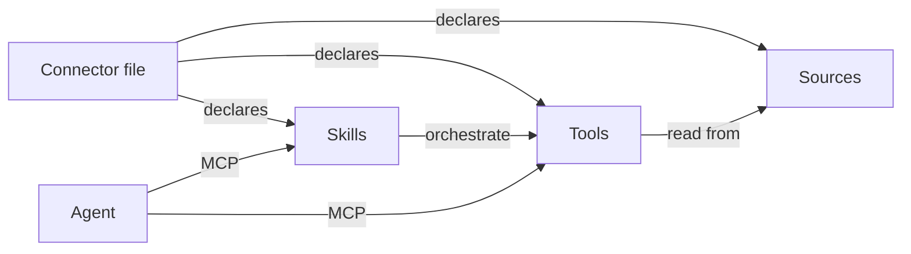

# Core concepts

Four nouns describe everything Elliot does: **source**, **tool**, **skill**, **connector**.

## Source

A source is anywhere your data lives. Today Elliot supports:

| Type | Backed by |
|---|---|
| `rest` | `httpx` + `jmespath` for nested API responses |
| `postgres` | `sqlalchemy` + `psycopg` |
| `mysql` | `sqlalchemy` + `pymysql` |
| `csv` / `json` | streamed into ephemeral in-memory SQLite |
| local files | `elliot_upload_file` stages into `.elliot/sources/` |

Auth is declared, never embedded:

```json
"auth": {
  "type": "api_key",
  "secret_key": "PETSTORE_API_KEY",
  "header_name": "X-Api-Key"
}
```

`PETSTORE_API_KEY` resolves at request time from the process environment.

## Tool

A tool is one verb-first operation exposed to agents. Declared with:

- `id` — stable, snake_case
- `name` — display name
- `description` — verb-first, what + when + return shape
- `category` — `READ` / `WRITE` / `ACTION`
- `sql` — a parameterised query (the runtime binds the params)
- `parameters` — typed, with descriptions

The runtime executes SQL against an ephemeral in-memory SQLite database that has been hydrated from your sources. That's what makes "REST + Postgres in one query" possible: everything ends up in the same engine, briefly.

## Skill

A skill is a prepared prompt template that orchestrates one or more tools. It teaches the agent how to *use* the tools — e.g. "to summarise animals by species, call `list_animals` then group on `species`".

```json
{
  "id": "animal_report",
  "name": "Animal population report",
  "tool_ids": ["list_animals"],
  "prompt_template": "Using the results of list_animals, group by species and return counts."
}
```

Skills are also delivered through MCP via `prompts/list` and `prompts/get`.

## Connector

A connector is the entire bundle — sources + tools + skills in one file. The file:

- has a stable `slug` (e.g. `"petstore"`)
- can be committed to your repo (no secrets in it)
- hot-reloads in the runtime via mtime + 30s TTL cache
- is what `elliot lint`, `elliot eval`, and `elliot deploy` operate on

See [Connector spec](./connectors) for the full JSON schema.

## How they fit together


